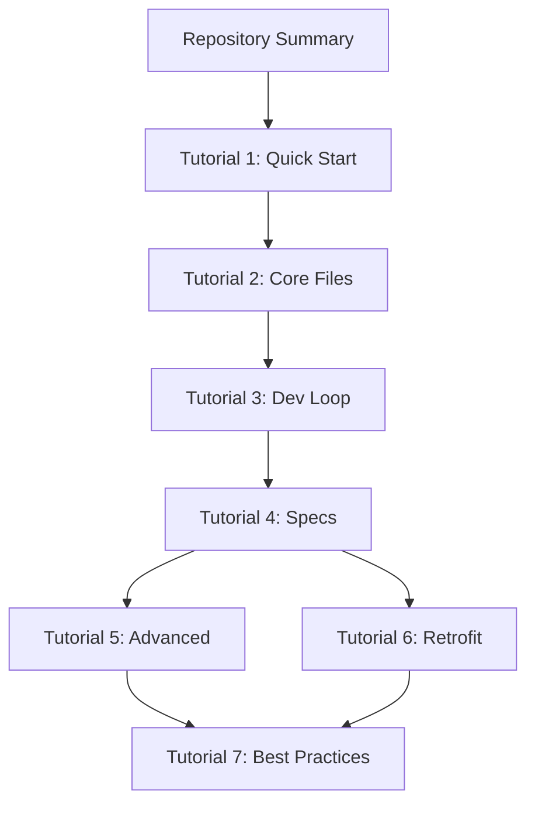

# Noderr Documentation Plan: Repository Summary & Tutorial Development

> **Version**: 1.0
> **Created**: 2026-01-09
> **Purpose**: Comprehensive plan for creating repository documentation and user tutorials

---

## Executive Summary

This document outlines a detailed plan for developing two key documentation deliverables:
1. **Modern Repository Summary** - A comprehensive overview of the Noderr framework
2. **Tutorial Development Guide** - Step-by-step instructions for using Noderr effectively

---

## Part 1: Repository Summary Plan

### 1.1 Summary Document Structure

```
NODERR_REPOSITORY_SUMMARY.md
├── 1. Introduction & Vision
│   ├── What is Noderr?
│   ├── Core Philosophy: "Code → Engineer"
│   ├── Target Audience
│   └── Real-World Problem Statement
│
├── 2. Key Innovations
│   ├── NodeID System (Permanent Identity)
│   ├── Visual Architecture (Mermaid Diagrams)
│   ├── ARC Verification (Quality Gates)
│   ├── Change Set Methodology
│   └── As-Built Documentation Principle
│
├── 3. Framework Architecture
│   ├── Directory Structure Overview
│   ├── Core Files Explained
│   │   ├── noderr_project.md (Constitution)
│   │   ├── noderr_architecture.md (Blueprint)
│   │   ├── noderr_tracker.md (Dashboard)
│   │   ├── noderr_loop.md (Protocol)
│   │   ├── noderr_log.md (History)
│   │   └── environment_context.md (Tactics)
│   └── Support Directories
│       ├── /specs/ (Component Blueprints)
│       ├── /prompts/ (AI Workflows)
│       └── /planning/ (Strategic Documents)
│
├── 4. The 25 Prompts System
│   ├── Main Loop Prompts (LOOP_1A through LOOP_3)
│   ├── Session Management Prompts
│   ├── Audit & Verification Prompts
│   ├── Specialized Task Prompts
│   └── Quick Reference Table
│
├── 5. Development Workflow
│   ├── The 5-Phase Main Loop
│   ├── Quality Gates Explained
│   ├── Git Integration Strategy
│   └── Session Continuity Model
│
├── 6. Technical Specifications
│   ├── Framework Agnostic Design
│   ├── Supported AI Assistants
│   ├── File Format Standards
│   └── Naming Conventions
│
├── 7. Comparison with Traditional AI Coding
│   ├── Side-by-Side Feature Matrix
│   ├── Before/After Scenarios
│   └── ROI & Quality Improvements
│
└── 8. Getting Started Quick Reference
    ├── Installation Checklist
    ├── First Session Walkthrough
    └── Common Commands Cheat Sheet
```

### 1.2 Summary Content Guidelines

| Section | Target Length | Priority | Content Focus |
|---------|---------------|----------|---------------|
| Introduction | 300-400 words | HIGH | Hook readers, explain value |
| Key Innovations | 500-700 words | HIGH | Unique selling points |
| Framework Architecture | 600-800 words | MEDIUM | Technical structure |
| Prompts System | 400-500 words | MEDIUM | Workflow commands |
| Development Workflow | 500-600 words | HIGH | Core methodology |
| Technical Specs | 300-400 words | LOW | Reference details |
| Comparison | 400-500 words | MEDIUM | Differentiation |
| Quick Reference | 200-300 words | HIGH | Actionable start |

**Total Estimated Length**: 3,200-4,200 words

### 1.3 Visual Assets Required

1. **Architecture Diagram** - Mermaid flowchart showing file relationships
2. **Workflow Diagram** - 5-phase loop visualization
3. **NodeID Examples** - Sample naming conventions
4. **Comparison Table** - Traditional vs Noderr approach
5. **Directory Tree** - ASCII representation of structure

---

## Part 2: Tutorial Development Plan

### 2.1 Tutorial Series Structure

```
TUTORIAL SERIES: "Mastering Noderr"
│
├── Tutorial 1: Quick Start (Beginner)
│   ├── Prerequisites Check
│   ├── Download & Installation
│   ├── First Project Setup
│   ├── Running Your First Prompt
│   └── Estimated Time: 15-20 minutes
│
├── Tutorial 2: Understanding the Core Files (Beginner)
│   ├── The Project Constitution
│   ├── Reading Architecture Diagrams
│   ├── Tracker Navigation
│   ├── Log Interpretation
│   └── Estimated Time: 20-25 minutes
│
├── Tutorial 3: The Development Loop (Intermediate)
│   ├── Phase 1: Propose Change Set
│   ├── Phase 2: Draft Specifications
│   ├── Phase 3: Implement
│   ├── Phase 4: Verify
│   ├── Phase 5: Finalize
│   └── Estimated Time: 30-40 minutes
│
├── Tutorial 4: Writing Effective Specifications (Intermediate)
│   ├── Spec Template Deep Dive
│   ├── ARC Verification Criteria
│   ├── Dependency Mapping
│   ├── Interface Definitions
│   └── Estimated Time: 25-30 minutes
│
├── Tutorial 5: Advanced Prompts & Workflows (Advanced)
│   ├── Security Audits
│   ├── Architecture Reviews
│   ├── Refactoring Nodes
│   ├── Mid-Project Feature Addition
│   └── Estimated Time: 35-45 minutes
│
├── Tutorial 6: Retrofitting Existing Projects (Advanced)
│   ├── Project Analysis
│   ├── NodeID Assignment Strategy
│   ├── Architecture Extraction
│   ├── Gradual Integration
│   └── Estimated Time: 40-50 minutes
│
└── Tutorial 7: Best Practices & Troubleshooting (Reference)
    ├── Common Pitfalls
    ├── Quality Maximization Tips
    ├── Session Management
    ├── FAQ & Solutions
    └── Estimated Time: 15-20 minutes
```

### 2.2 Tutorial Format Template

Each tutorial should follow this structure:

```markdown
# Tutorial [N]: [Title]

## Overview
- **Difficulty**: Beginner / Intermediate / Advanced
- **Time Required**: X-Y minutes
- **Prerequisites**: [List]
- **Learning Objectives**: [3-5 bullet points]

## Introduction
[2-3 paragraphs explaining what will be covered and why]

## Step-by-Step Instructions

### Step 1: [Action Name]
**What you'll do**: [Brief description]

1. [Specific instruction]
2. [Specific instruction]
3. [Specific instruction]

> **Tip**: [Helpful hint or best practice]

**Expected Result**: [What should happen]

### Step 2: [Action Name]
[Continue pattern...]

## Practical Exercise
[Hands-on task for readers to complete]

### Exercise Requirements
- [ ] Task 1
- [ ] Task 2
- [ ] Task 3

### Solution
<details>
<summary>Click to reveal solution</summary>
[Step-by-step solution]
</details>

## Common Issues & Solutions

| Issue | Cause | Solution |
|-------|-------|----------|
| [Problem] | [Why it happens] | [How to fix] |

## Key Takeaways
- [Important point 1]
- [Important point 2]
- [Important point 3]

## Next Steps
[Link to next tutorial or related resources]
```

### 2.3 Tutorial Development Phases

#### Phase 1: Foundation Tutorials (Week 1)
| Tutorial | Status | Priority | Dependencies |
|----------|--------|----------|--------------|
| Tutorial 1: Quick Start | TODO | CRITICAL | None |
| Tutorial 2: Core Files | TODO | HIGH | Tutorial 1 |

#### Phase 2: Core Workflow Tutorials (Week 2)
| Tutorial | Status | Priority | Dependencies |
|----------|--------|----------|--------------|
| Tutorial 3: Development Loop | TODO | CRITICAL | Tutorial 2 |
| Tutorial 4: Specifications | TODO | HIGH | Tutorial 3 |

#### Phase 3: Advanced Tutorials (Week 3)
| Tutorial | Status | Priority | Dependencies |
|----------|--------|----------|--------------|
| Tutorial 5: Advanced Prompts | TODO | MEDIUM | Tutorial 4 |
| Tutorial 6: Retrofitting | TODO | MEDIUM | Tutorial 4 |
| Tutorial 7: Best Practices | TODO | LOW | All previous |

### 2.4 Sample Content Specifications

#### Tutorial 1: Quick Start - Detailed Outline

```
1. PREREQUISITES CHECK (3 min)
   - Git installed and configured
   - AI assistant available (Claude, ChatGPT, Cursor, etc.)
   - Text editor or IDE ready
   - Basic command line familiarity

2. DOWNLOAD & INSTALLATION (5 min)
   - Download noderr.starter.zip from releases
   - Extract to project directory
   - Verify file structure
   - Initial git commit

3. FIRST PROJECT SETUP (5 min)
   - Run "Install and Reconcile" prompt
   - AI analyzes existing codebase (if any)
   - Generates initial architecture diagram
   - Creates project constitution

4. RUNNING YOUR FIRST PROMPT (5 min)
   - Copy "Start Work Session" prompt
   - Paste to AI assistant
   - Observe AI reading Noderr files
   - Review session initialization output

5. VERIFICATION (2 min)
   - Check tracker shows TODO items
   - Confirm architecture diagram exists
   - Validate project.md is populated
```

#### Tutorial 3: Development Loop - Detailed Outline

```
1. PHASE OVERVIEW (5 min)
   - Explain 5-phase methodology
   - Show visual workflow diagram
   - Define key terms: Change Set, NodeID, WorkGroupID

2. PHASE 1A: PROPOSE CHANGE SET (10 min)
   - Scenario: Add user authentication feature
   - Copy LOOP_1A prompt
   - Walk through AI's impact analysis
   - Review generated Change Set list
   - Explain why complete sets matter

3. PHASE 1B: DRAFT SPECIFICATIONS (10 min)
   - Continue with LOOP_1B prompt
   - Watch AI create specs for each NodeID
   - Review spec template structure
   - User approval checkpoint explanation

4. PHASE 2A: IMPLEMENT (8 min)
   - Execute LOOP_2A prompt
   - AI implements all Change Set nodes
   - Explain parallel vs sequential implementation
   - Initial self-verification

5. PHASE 2B: VERIFY (8 min)
   - Independent audit process
   - Completion percentage calculation
   - Gap analysis and reporting
   - Decision points: accept, iterate, modify

6. PHASE 3: FINALIZE (5 min)
   - As-built spec updates
   - Architecture diagram updates
   - Log entries
   - Git commit with WorkGroupID
```

---

## Part 3: Implementation Roadmap

### 3.1 Development Milestones

```
MILESTONE 1: Repository Summary (Days 1-2)
├── Draft summary document structure
├── Write all 8 sections
├── Create visual diagrams
├── Internal review
└── Deliverable: NODERR_REPOSITORY_SUMMARY.md

MILESTONE 2: Beginner Tutorials (Days 3-5)
├── Tutorial 1: Quick Start
├── Tutorial 2: Core Files
├── Test with fresh user perspective
└── Deliverable: tutorials/beginner/

MILESTONE 3: Intermediate Tutorials (Days 6-8)
├── Tutorial 3: Development Loop
├── Tutorial 4: Specifications
├── Include practical exercises
└── Deliverable: tutorials/intermediate/

MILESTONE 4: Advanced Tutorials (Days 9-11)
├── Tutorial 5: Advanced Prompts
├── Tutorial 6: Retrofitting
├── Tutorial 7: Best Practices
└── Deliverable: tutorials/advanced/

MILESTONE 5: Integration & Polish (Days 12-14)
├── Cross-reference all documents
├── Create navigation index
├── Add search-friendly headers
├── Final review
└── Deliverable: Complete documentation suite
```

### 3.2 File Organization Plan

```
/home/user/noderr/
├── docs/
│   ├── NODERR_REPOSITORY_SUMMARY.md      (NEW)
│   ├── tutorials/                         (NEW)
│   │   ├── README.md                      (Tutorial Index)
│   │   ├── 01-quick-start.md
│   │   ├── 02-core-files.md
│   │   ├── 03-development-loop.md
│   │   ├── 04-writing-specifications.md
│   │   ├── 05-advanced-prompts.md
│   │   ├── 06-retrofitting-projects.md
│   │   └── 07-best-practices.md
│   ├── noderr_getting_started.md          (EXISTING - link from tutorials)
│   ├── understanding-noderr.md            (EXISTING - reference)
│   ├── noderr_prompts_guide.md            (EXISTING - reference)
│   └── noderr_guide.md                    (EXISTING - reference)
```

### 3.3 Quality Assurance Checklist

#### For Repository Summary:
- [ ] All sections complete and coherent
- [ ] Technical accuracy verified against source files
- [ ] Visual diagrams render correctly
- [ ] Links to related documentation work
- [ ] Consistent terminology throughout
- [ ] Appropriate for target audience (developers, AI practitioners)

#### For Each Tutorial:
- [ ] Learning objectives clearly stated
- [ ] Steps are reproducible
- [ ] Expected results documented
- [ ] Common issues addressed
- [ ] Exercise solution provided
- [ ] Links to next tutorial
- [ ] Tested on fresh environment

---

## Part 4: Content Specifications

### 4.1 Writing Style Guide

| Aspect | Guideline |
|--------|-----------|
| **Voice** | Active, direct, instructional |
| **Tone** | Professional but approachable |
| **Audience Level** | Developers with AI assistant experience |
| **Technical Depth** | Explain concepts, don't assume knowledge |
| **Code Examples** | Use realistic, complete snippets |
| **Formatting** | Markdown with clear hierarchy |

### 4.2 Terminology Standards

| Term | Definition | Usage |
|------|------------|-------|
| **NodeID** | Unique identifier for each component | Always capitalize |
| **Change Set** | Complete group of affected NodeIDs | Two words, capitalized |
| **WorkGroupID** | Batch identifier for related work | Camel case |
| **ARC Verification** | Attentive Review & Compliance | Always expand first use |
| **As-Built** | Documentation matching implementation | Hyphenated |
| **Spec** | Specification document | Acceptable abbreviation |

### 4.3 Visual Standards

- **Diagrams**: Mermaid format for version control compatibility
- **Screenshots**: PNG format, 1200px max width, with annotations
- **Code Blocks**: Syntax-highlighted with language identifier
- **Tables**: Used for comparisons and reference data
- **Callouts**: Use blockquotes for tips, warnings, notes

---

## Part 5: Success Metrics

### 5.1 Documentation Quality Metrics

| Metric | Target | Measurement |
|--------|--------|-------------|
| Completeness | 100% of planned sections | Checklist completion |
| Accuracy | 0 factual errors | Technical review |
| Clarity | Grade 10-12 reading level | Readability score |
| Usefulness | 80%+ positive feedback | User surveys |

### 5.2 Tutorial Effectiveness Metrics

| Metric | Target | Measurement |
|--------|--------|-------------|
| Completion Rate | >70% users finish | Analytics tracking |
| Time to First Success | <30 minutes | User testing |
| Support Requests | <10% users need help | Issue tracking |
| Concept Retention | >80% on quiz | Optional assessment |

---

## Appendix A: Quick Reference Cards

### A.1 Repository Structure At-a-Glance

```
CORE FILES (The Brain)
├── noderr_project.md     → What we're building
├── noderr_architecture.md → How it connects
├── noderr_tracker.md     → Where we are
├── noderr_loop.md        → How to work
├── noderr_log.md         → What happened
└── environment_context.md → Platform specifics

SUPPORT DIRECTORIES (The Muscles)
├── /specs/               → Component blueprints
├── /prompts/             → AI commands (25)
├── /planning/            → Strategy documents
└── /docs/                → User guides
```

### A.2 Main Loop Quick Reference

```
┌─────────────────────────────────────────────────────────────┐
│  NODERR DEVELOPMENT LOOP                                    │
├─────────────────────────────────────────────────────────────┤
│                                                             │
│  1A. PROPOSE    →  Identify all affected NodeIDs            │
│       ↓                                                     │
│  1B. DRAFT      →  Create specs for each NodeID             │
│       ↓            [PAUSE FOR APPROVAL]                     │
│  2A. IMPLEMENT  →  Build all Change Set nodes               │
│       ↓                                                     │
│  2B. VERIFY     →  Independent audit (X% complete)          │
│       ↓            [ACCEPT / ITERATE / MODIFY]              │
│  3.  FINALIZE   →  Update docs + commit + log               │
│                                                             │
└─────────────────────────────────────────────────────────────┘
```

### A.3 Prompt Categories Quick Reference

| Category | Prompts | When to Use |
|----------|---------|-------------|
| **Main Loop** | LOOP_1A, 1B, 2A, 2B, 3 | Standard development |
| **Session** | Start_Work_Session, Resume_Active_Loop | Begin/continue work |
| **Setup** | Install_And_Reconcile, Post_Installation_Audit | New projects |
| **Audit** | Holistic_Integration, Security, Architecture_Health | Quality reviews |
| **Special** | Micro_Fix, Refactor_Node, Handle_Critical_Issue | Targeted tasks |
| **Planning** | Feature_Idea_Breakdown, Strategic_Blueprint | Design phase |

---

## Appendix B: Implementation Notes

### B.1 Dependencies Between Documents



### B.2 Review Process

1. **Self-Review**: Author checks against guidelines
2. **Technical Review**: Verify accuracy against source files
3. **User Testing**: Fresh user attempts to follow tutorial
4. **Final Polish**: Address feedback, fix issues

### B.3 Maintenance Plan

- **Monthly**: Check for broken links, outdated info
- **Per Release**: Update for new prompts/features
- **Annually**: Comprehensive review and refresh

---

## Conclusion

This plan provides a comprehensive roadmap for creating professional documentation that will:

1. **Communicate Value**: Clear repository summary explaining what Noderr does and why it matters
2. **Enable Adoption**: Step-by-step tutorials taking users from zero to productive
3. **Reduce Friction**: Anticipate questions and provide answers proactively
4. **Scale Knowledge**: Self-service documentation reducing support burden

The structured approach ensures consistency, completeness, and quality across all deliverables.

---

*Document Status: APPROVED FOR IMPLEMENTATION*
*Next Action: Begin Repository Summary development*
