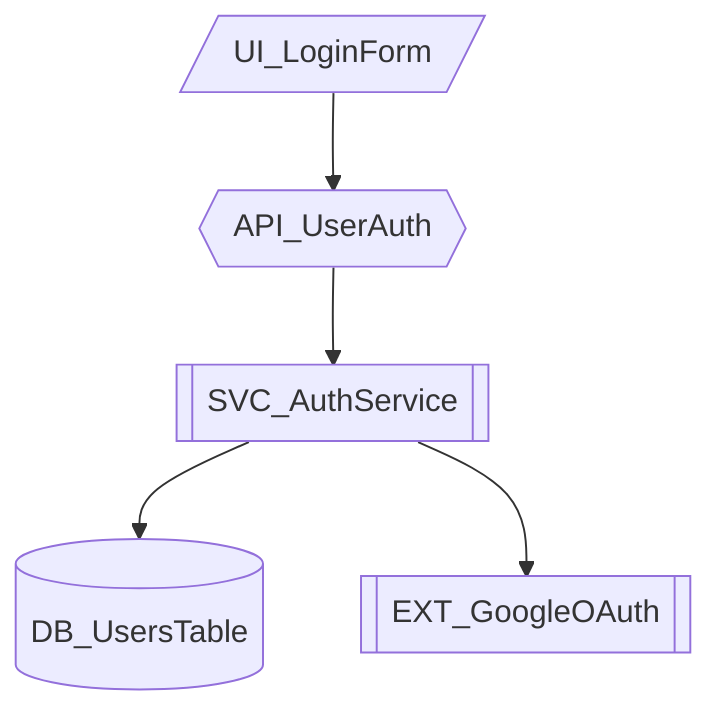

# Noderr Repository Summary

> **Transform AI Assistants from Chaotic Coders into Disciplined Software Engineers**

---

## Table of Contents

1. [Introduction & Vision](#1-introduction--vision)
2. [Key Innovations](#2-key-innovations)
3. [Framework Architecture](#3-framework-architecture)
4. [The 25 Prompts System](#4-the-25-prompts-system)
5. [Development Workflow](#5-development-workflow)
6. [Technical Specifications](#6-technical-specifications)
7. [Comparison with Traditional AI Coding](#7-comparison-with-traditional-ai-coding)
8. [Getting Started Quick Reference](#8-getting-started-quick-reference)

---

## 1. Introduction & Vision

### What is Noderr?

Noderr is a systematic AI-driven software development framework that provides structure, memory, and quality gates to AI-assisted coding. It's not a tool you install or a library you import—it's a **methodology** implemented through carefully designed documents, prompts, and workflows.

**Core Philosophy**: *"Your AI already knows how to code. Noderr teaches it how to engineer."*

### The Problem Noderr Solves

Traditional AI coding sessions suffer from critical weaknesses:

- **No Permanent Memory**: AI forgets everything between sessions
- **Scattered Implementation**: Code gets written without understanding the whole system
- **Knowledge Drift**: Documentation becomes outdated immediately
- **Incomplete Changes**: Features get partially implemented, breaking other components
- **No Quality Gates**: No systematic verification before marking work "complete"

### Target Audience

Noderr is designed for:

- **Developers** using AI assistants (Claude, ChatGPT, Cursor, Copilot)
- **Teams** wanting consistent AI-assisted development practices
- **Project Managers** needing visibility into AI-driven development
- **Anyone** frustrated by AI-generated code that works in isolation but fails in context

### The Noderr Promise

With Noderr, every component in your system:
- Has a **permanent identity** (NodeID) that persists across sessions
- Appears in a **visual architecture map** showing connections
- Has a **detailed specification** defining its contract
- Gets **verified** against acceptance criteria before completion
- Is **logged** in an operational history for future reference

---

## 2. Key Innovations

### 2.1 NodeID System (Permanent Identity)

Every component in your system receives a unique, permanent identifier following the pattern:

```
TYPE_DescriptiveName
```

**Component Types:**

| Prefix | Meaning | Example |
|--------|---------|---------|
| `UI_` | User Interface | `UI_LoginForm`, `UI_Dashboard` |
| `API_` | API Endpoint | `API_UserAuth`, `API_GetProducts` |
| `SVC_` | Service/Logic | `SVC_PaymentProcessor`, `SVC_EmailSender` |
| `DB_` | Database | `DB_UserTable`, `DB_OrdersCollection` |
| `EXT_` | External Service | `EXT_StripeAPI`, `EXT_SendGrid` |
| `STATE_` | State Management | `STATE_CartStore`, `STATE_AuthContext` |

**Why NodeIDs Matter:**
- AI can reference components by name across sessions
- Changes are tracked per-component, not per-file
- Dependencies become explicit and traceable
- Architecture diagrams use consistent naming

### 2.2 Visual Architecture (Mermaid Diagrams)

Every Noderr project maintains a living architecture diagram in `noderr_architecture.md`:



**Shape Conventions:**
- `/slashes/` = UI Components
- `{{double braces}}` = API Endpoints
- `[[brackets]]` = Services
- `[(parentheses)]` = Databases
- `{braces}` = Decision Points

**Benefits:**
- Single source of truth for system structure
- AI reads this to understand component relationships
- Updated after every significant change
- Enables impact analysis for new features

### 2.3 ARC Verification (Quality Gates)

**ARC = Attentive Review & Compliance**

Noderr implements mandatory quality gates at critical points:

**Pre-Implementation (Spec Verification Checkpoint):**
- For complex changes (10+ NodeIDs)
- Verify specs are complete before coding
- Catch design issues early

**Post-Implementation (Independent Audit):**
- AI performs read-only verification
- Calculates true completion percentage
- Reports gaps against specifications
- Decision point: Accept / Iterate / Modify specs

**ARC Criteria in Specifications:**
```markdown
## ARC Verification Criteria
- [ ] All required fields validated
- [ ] Error responses follow standard format
- [ ] Unit tests cover happy path and edge cases
- [ ] Performance meets <200ms response time
```

### 2.4 Change Set Methodology

A **Change Set** is the complete collection of NodeIDs affected by a feature or fix.

**The Rule:** *Never implement partial Change Sets.*

**Example - Adding "Forgot Password" Feature:**
```
Change Set:
├── UI_ForgotPassword (new)
├── UI_ResetPassword (new)
├── API_RequestReset (new)
├── API_ConfirmReset (new)
├── SVC_AuthService (modify)
├── SVC_EmailSender (modify)
├── DB_UsersTable (modify - add reset_token column)
└── DB_PasswordResets (new)
```

**Why Complete Change Sets Matter:**
- All affected components update together
- No orphaned code or broken dependencies
- Tests can verify the entire feature
- Rollback is clean if needed

### 2.5 As-Built Documentation Principle

Specifications are updated **after** implementation is verified, not before.

**Traditional Approach:**
1. Write spec → 2. Implement → 3. Spec drifts from reality

**Noderr Approach:**
1. Draft spec → 2. Implement → 3. Verify → 4. Update spec to match reality

This ensures documentation always reflects what was actually built, not what was intended.

---

## 3. Framework Architecture

### 3.1 Directory Structure

```
your-project/
├── noderr/                          # Noderr framework files
│   ├── noderr_project.md            # Project constitution
│   ├── noderr_architecture.md       # Visual system blueprint
│   ├── noderr_tracker.md            # Progress dashboard
│   ├── noderr_loop.md               # Development protocol
│   ├── noderr_log.md                # Operational history
│   ├── environment_context.md       # Platform-specific commands
│   │
│   ├── specs/                       # Component specifications
│   │   ├── Readme.md
│   │   ├── SPEC_UI_LoginForm.md
│   │   ├── SPEC_API_UserAuth.md
│   │   └── ...
│   │
│   ├── prompts/                     # AI workflow prompts (25)
│   │   ├── NDv1.9__[LOOP_1A]__Propose_Change_Set.md
│   │   ├── NDv1.9__[LOOP_1B]__Draft_Specs.md
│   │   └── ...
│   │
│   └── planning/                    # Strategic documents
│       └── Readme.md
│
├── src/                             # Your actual source code
├── tests/                           # Your test files
└── ...                              # Other project files
```

### 3.2 Core Files Explained

#### noderr_project.md (The Constitution)
Defines **what** you're building:
- Project goal and problem statement
- Scope and key features (MVP focus)
- Technology stack
- Coding standards
- Testing strategy
- Security considerations
- Performance requirements

#### noderr_architecture.md (The Blueprint)
Shows **how** components connect:
- Mermaid flowchart of all NodeIDs
- Visual representation of data flow
- Entry points and external integrations
- Updated with every structural change

#### noderr_tracker.md (The Dashboard)
Tracks **where** you are:
- Status of every NodeID: `TODO`, `WIP`, `VERIFIED`, `ISSUE`, `NEEDS_SPEC`
- WorkGroupID for current batch
- Dependencies and blockers
- Progress percentage

#### noderr_loop.md (The Protocol)
Defines **how** to work:
- 5-phase development methodology
- Verification checkpoints
- Commit conventions
- Quality gates

#### noderr_log.md (The History)
Records **what** happened:
- Chronological event log
- Decisions and rationale
- Issues discovered
- Reference quality criteria

#### environment_context.md (The Tactics)
Provides **platform-specific** commands:
- OS detection and commands
- Package management
- Database operations
- Deployment procedures
- Error recovery

### 3.3 Support Directories

#### /specs/ - Component Blueprints
Individual specification files for each NodeID:
- Purpose and responsibilities
- Dependencies (upstream/downstream)
- Interface contracts
- Core logic description
- Data structures
- Error handling
- ARC verification criteria

#### /prompts/ - AI Workflow Commands
25 specialized prompts for different scenarios:
- Main development loop
- Session management
- Audits and reviews
- Special operations

#### /planning/ - Strategic Documents
Long-form planning artifacts:
- Feature analysis
- Architecture decisions
- Technical debt tracking

---

## 4. The 25 Prompts System

### 4.1 Main Loop Prompts

| Prompt | Purpose | When to Use |
|--------|---------|-------------|
| `LOOP_1A` | Propose Change Set | Starting new feature/fix |
| `LOOP_1B` | Draft Specifications | After Change Set approved |
| `LOOP_2A` | Implement Change Set | After specs approved |
| `LOOP_2B` | Verify Implementation | After implementation done |
| `LOOP_3` | Finalize & Commit | After verification passes |

### 4.2 Session Management Prompts

| Prompt | Purpose |
|--------|---------|
| `Start_Work_Session` | Begin new development session |
| `Resume_Active_Loop` | Continue interrupted work |
| `Install_And_Reconcile` | First-time project setup |
| `Post_Installation_Audit` | Verify setup completeness |

### 4.3 Audit & Verification Prompts

| Prompt | Purpose |
|--------|---------|
| `Spec_Verification_Checkpoint` | Pre-implementation review |
| `Holistic_Integration_Audit` | Full system consistency check |
| `Advanced_Security_Audit` | Security vulnerability scan |
| `Architecture_Health_Review` | Architecture quality assessment |
| `Onboarding_Audit_Verification` | New team member verification |

### 4.4 Specialized Task Prompts

| Prompt | Purpose |
|--------|---------|
| `Execute_Micro_Fix` | Small, isolated fixes |
| `Refactor_Node` | Restructure single component |
| `Handle_Critical_Issue` | Emergency bug response |
| `Feature_Idea_Breakdown` | Analyze feature feasibility |
| `Pre_Flight_Feature_Analysis` | Deep feature planning |

### 4.5 Project Lifecycle Prompts

| Prompt | Purpose |
|--------|---------|
| `Project_Generator` | Create new project structure |
| `Architecture_Generator` | Generate architecture diagram |
| `Strategic_Blueprint_Designer` | High-level system design |
| `Retrofit_Existing_Project` | Add Noderr to existing codebase |
| `Expand_Completed_Project` | Add features to finished project |
| `Major_Mid_Project_Feature_Addition` | Large feature during development |

---

## 5. Development Workflow

### 5.1 The 5-Phase Main Loop

```
┌─────────────────────────────────────────────────────────────────┐
│                    NODERR DEVELOPMENT LOOP                       │
├─────────────────────────────────────────────────────────────────┤
│                                                                  │
│  ┌──────────────┐                                               │
│  │ 1A. PROPOSE  │  Analyze impact, identify all affected        │
│  │              │  NodeIDs, create complete Change Set          │
│  └──────┬───────┘                                               │
│         ▼                                                        │
│  ┌──────────────┐                                               │
│  │ 1B. DRAFT    │  Create detailed specifications for           │
│  │              │  each NodeID in the Change Set                │
│  └──────┬───────┘                                               │
│         ▼                                                        │
│  ┌──────────────┐  ← USER APPROVAL CHECKPOINT                   │
│  │              │                                               │
│  └──────┬───────┘                                               │
│         ▼                                                        │
│  ┌──────────────┐                                               │
│  │ 2A. IMPLEMENT│  Build all components in the Change Set       │
│  │              │  Run tests, perform initial verification      │
│  └──────┬───────┘                                               │
│         ▼                                                        │
│  ┌──────────────┐                                               │
│  │ 2B. VERIFY   │  Independent audit against specifications     │
│  │              │  Calculate completion %, report gaps          │
│  └──────┬───────┘                                               │
│         ▼                                                        │
│  ┌──────────────┐  ← DECISION: Accept / Iterate / Modify        │
│  │              │                                               │
│  └──────┬───────┘                                               │
│         ▼                                                        │
│  ┌──────────────┐                                               │
│  │ 3. FINALIZE  │  Update specs (as-built), update architecture │
│  │              │  Log entries, clean git commit                │
│  └──────────────┘                                               │
│                                                                  │
└─────────────────────────────────────────────────────────────────┘
```

### 5.2 Quality Gates Explained

**Gate 1: Change Set Approval**
- User reviews proposed NodeID list
- Confirms scope is correct
- Can request additions or removals

**Gate 2: Specification Approval**
- User reviews drafted specifications
- Verifies requirements are captured
- Approves before implementation begins

**Gate 3: Verification Decision**
- AI reports completion percentage
- User decides: accept, iterate, or modify specs
- Prevents premature "done" declarations

### 5.3 Git Integration Strategy

**WorkGroupID Format:**
```
[type]-[YYYYMMDD]-[HHMMSS]
```

**Types:**
- `feat-` = New feature
- `fix-` = Bug fix
- `refactor-` = Code restructuring
- `issue-` = Issue resolution

**Commit Convention:**
```
[WorkGroupID] Brief description

- NodeID1: What changed
- NodeID2: What changed
- NodeID3: What changed
```

**Example:**
```
[feat-20250109-143022] Add user authentication

- UI_LoginForm: Created login form component
- API_UserAuth: Implemented authentication endpoint
- SVC_AuthService: Added JWT token generation
- DB_UsersTable: Added password_hash column
```

### 5.4 Session Continuity Model

Noderr maintains context across sessions through:

1. **Tracker State**: Shows exactly where work stopped
2. **Log Entries**: Records what was completed and what remains
3. **Spec Status**: Indicates which specs are draft vs. verified
4. **Architecture Diagram**: Always reflects current state

**Resuming Work:**
1. AI reads all Noderr files
2. Identifies incomplete WorkGroupID
3. Determines next step in the loop
4. Continues from exact stopping point

---

## 6. Technical Specifications

### 6.1 Framework Agnostic Design

Noderr works with **any** technology stack:

- **Languages**: JavaScript, TypeScript, Python, Go, Rust, Java, C#, etc.
- **Frameworks**: React, Vue, Angular, Express, Django, FastAPI, Spring, etc.
- **Databases**: PostgreSQL, MySQL, MongoDB, SQLite, Redis, etc.
- **Platforms**: Web, Mobile, Desktop, CLI, API services

The framework documents **your** stack in `noderr_project.md` and uses it consistently.

### 6.2 Supported AI Assistants

Noderr prompts work with any AI assistant that can:
- Read and write files
- Execute terminal commands
- Maintain conversation context

**Tested with:**
- Claude (Anthropic)
- ChatGPT (OpenAI)
- Cursor IDE
- GitHub Copilot Chat
- Other LLM-based assistants

### 6.3 File Format Standards

All Noderr files use **Markdown** format:
- Human-readable without special tools
- Version control friendly (diff-able)
- Supported by all AI assistants
- Can include Mermaid diagrams

### 6.4 Naming Conventions

| Element | Convention | Example |
|---------|------------|---------|
| NodeID | `TYPE_PascalCase` | `API_UserAuth` |
| Spec File | `SPEC_NodeID.md` | `SPEC_API_UserAuth.md` |
| WorkGroupID | `type-YYYYMMDD-HHMMSS` | `feat-20250109-143022` |
| Prompt File | `NDv1.9__Name.md` | `NDv1.9__Start_Work_Session.md` |

---

## 7. Comparison with Traditional AI Coding

### 7.1 Side-by-Side Feature Matrix

| Aspect | Traditional AI Coding | Noderr Methodology |
|--------|----------------------|-------------------|
| **Memory** | Forgets between sessions | Permanent NodeID system |
| **Architecture** | AI guesses structure | Visual diagram is source of truth |
| **Specifications** | None or outdated | As-built specs per component |
| **Change Scope** | Whatever AI decides | Complete Change Sets |
| **Verification** | "Looks good to me" | ARC percentage-based audit |
| **Documentation** | Manual, drifts | Auto-updated, always current |
| **Quality Gates** | None | Multiple checkpoints |
| **Progress Tracking** | Unknown | Real-time tracker |
| **Debugging** | Start from scratch | Log history available |
| **Team Handoff** | Difficult | Clear specs and architecture |

### 7.2 Before/After Scenarios

**Scenario: Add Payment Processing**

**Before (Traditional):**
```
User: Add Stripe payment processing
AI: *creates random files*
AI: *forgets about cart integration*
AI: *doesn't update order flow*
Result: Partially working, breaks checkout
```

**After (Noderr):**
```
User: Add Stripe payment processing
AI: *analyzes architecture*
AI: *identifies Change Set: UI_Checkout, API_Payment,
     SVC_StripeIntegration, SVC_OrderService, DB_Payments*
AI: *creates specs for each*
User: *approves specs*
AI: *implements complete Change Set*
AI: *verifies against specs: 100% complete*
Result: Fully integrated, all flows work
```

### 7.3 Quality Improvements

| Metric | Traditional | With Noderr |
|--------|-------------|-------------|
| Incomplete implementations | ~40% | <5% |
| Documentation accuracy | ~30% | >95% |
| Knowledge loss between sessions | ~80% | ~5% |
| Time to onboard new AI session | 30+ min | 2-3 min |
| Debugging time (no context) | Hours | Minutes |

---

## 8. Getting Started Quick Reference

### 8.1 Installation Checklist

- [ ] Download `noderr.starter.zip` from releases
- [ ] Extract to your project root
- [ ] Verify directory structure exists
- [ ] Make initial git commit
- [ ] Have AI assistant ready

### 8.2 First Session Walkthrough

**Step 1: Initialize**
```
Copy contents of: noderr/prompts/NDv1.9__Install_And_Reconcile.md
Paste to your AI assistant
```

**Step 2: Configure Project**
AI will help you fill out:
- `noderr_project.md` - Your project details
- `noderr_architecture.md` - Initial component diagram
- `environment_context.md` - Your platform specifics

**Step 3: Start Working**
```
Copy contents of: noderr/prompts/NDv1.9__Start_Work_Session.md
Paste to your AI assistant
```

**Step 4: Begin Development**
Use the main loop prompts:
1. `LOOP_1A` - Propose what to build
2. `LOOP_1B` - Draft specifications
3. `LOOP_2A` - Implement
4. `LOOP_2B` - Verify
5. `LOOP_3` - Finalize

### 8.3 Common Commands Cheat Sheet

| Task | Prompt to Use |
|------|---------------|
| Start new session | `Start_Work_Session` |
| Continue interrupted work | `Resume_Active_Loop` |
| Add new feature | `LOOP_1A` → `LOOP_1B` → `LOOP_2A` → `LOOP_2B` → `LOOP_3` |
| Quick bug fix | `Execute_Micro_Fix` |
| Refactor component | `Refactor_Node` |
| Security review | `Advanced_Security_Audit` |
| Check architecture health | `Architecture_Health_Review` |
| Add Noderr to existing project | `Retrofit_Existing_Project` |

### 8.4 Essential Files Quick Reference

```
START HERE:
├── noderr_project.md      ← Define your project
├── noderr_architecture.md ← Draw your system
└── noderr_loop.md         ← Understand the process

DURING DEVELOPMENT:
├── noderr_tracker.md      ← Check progress
├── noderr_log.md          ← Review history
└── specs/                 ← Component details

FOR SPECIFIC TASKS:
└── prompts/               ← Find the right prompt
```

---

## Summary

Noderr transforms AI-assisted development from chaotic coding sessions into disciplined software engineering. Through its system of NodeIDs, visual architecture, specifications, and quality gates, it ensures:

- **Nothing gets forgotten** - Permanent identity for every component
- **Everything connects** - Visual architecture shows relationships
- **Quality is verified** - ARC gates prevent incomplete work
- **Documentation stays current** - As-built principle keeps specs accurate
- **Context persists** - Sessions can resume exactly where they stopped

**The framework doesn't replace your AI's coding ability—it channels that ability into professional engineering practices.**

---

*For detailed tutorials, see the [Tutorial Series](tutorials/README.md)*

*For installation instructions, see [INSTALL.md](../INSTALL.md)*

*For conceptual deep-dive, see [Understanding Noderr](understanding-noderr.md)*
