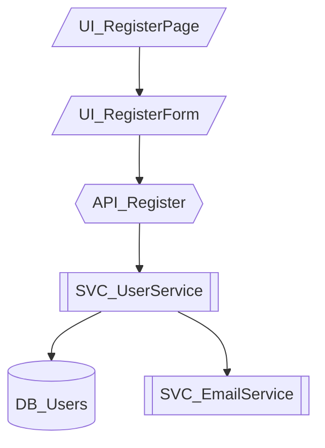

# Tutorial 3: The Development Loop

> **Master the 5-Phase Workflow That Powers Noderr**

---

## Overview

| | |
|---|---|
| **Difficulty** | Intermediate |
| **Time Required** | 30-40 minutes |
| **Prerequisites** | Completed Tutorials 1 & 2 |

### Learning Objectives

By the end of this tutorial, you will:

- Execute the complete 5-phase development loop
- Understand what happens in each phase
- Know when to pause for approval vs. continue
- Handle the verification and decision points
- Create proper git commits with WorkGroupIDs

---

## Introduction

The development loop is the heart of Noderr. It transforms chaotic AI coding into disciplined software engineering through a structured 5-phase process:

1. **Propose** - Identify what needs to change
2. **Draft** - Create specifications
3. **Implement** - Build the code
4. **Verify** - Audit against specs
5. **Finalize** - Document and commit

This tutorial walks you through each phase with a real example: adding a "user registration" feature to a web application.

---

## The Complete Loop Visualized

```
┌──────────────────────────────────────────────────────────────────────┐
│                       THE NODERR DEVELOPMENT LOOP                     │
├──────────────────────────────────────────────────────────────────────┤
│                                                                       │
│   ┌─────────────┐                                                    │
│   │   START     │   User requests: "Add user registration"           │
│   └──────┬──────┘                                                    │
│          │                                                           │
│          ▼                                                           │
│   ┌─────────────┐   ┌─────────────────────────────────────────────┐ │
│   │  PHASE 1A   │   │ • Analyze impact                            │ │
│   │  PROPOSE    │──▶│ • Identify ALL affected NodeIDs             │ │
│   │             │   │ • Create Change Set list                    │ │
│   └──────┬──────┘   └─────────────────────────────────────────────┘ │
│          │                                                           │
│          ▼                                                           │
│   ┌─────────────┐   ┌─────────────────────────────────────────────┐ │
│   │  PHASE 1B   │   │ • Create spec for each NodeID               │ │
│   │   DRAFT     │──▶│ • Define interfaces & dependencies          │ │
│   │             │   │ • Set ARC verification criteria             │ │
│   └──────┬──────┘   └─────────────────────────────────────────────┘ │
│          │                                                           │
│          ▼                                                           │
│   ╔═════════════╗                                                    │
│   ║   PAUSE     ║   User reviews and approves specifications         │
│   ╚══════╤══════╝                                                    │
│          │                                                           │
│          ▼                                                           │
│   ┌─────────────┐   ┌─────────────────────────────────────────────┐ │
│   │  PHASE 2A   │   │ • Build all Change Set nodes                │ │
│   │ IMPLEMENT   │──▶│ • Run tests                                 │ │
│   │             │   │ • Initial self-check                        │ │
│   └──────┬──────┘   └─────────────────────────────────────────────┘ │
│          │                                                           │
│          ▼                                                           │
│   ┌─────────────┐   ┌─────────────────────────────────────────────┐ │
│   │  PHASE 2B   │   │ • Independent read-only audit               │ │
│   │   VERIFY    │──▶│ • Calculate completion %                    │ │
│   │             │   │ • Report gaps against specs                 │ │
│   └──────┬──────┘   └─────────────────────────────────────────────┘ │
│          │                                                           │
│          ▼                                                           │
│   ╔═════════════╗   ┌─────────────────────────────────────────────┐ │
│   ║  DECISION   ║   │ • ACCEPT: Proceed to finalize               │ │
│   ║   POINT     ║──▶│ • ITERATE: Return to 2A, fix gaps           │ │
│   ╚══════╤══════╝   │ • MODIFY: Adjust specs, re-implement        │ │
│          │          └─────────────────────────────────────────────┘ │
│          ▼                                                           │
│   ┌─────────────┐   ┌─────────────────────────────────────────────┐ │
│   │  PHASE 3    │   │ • Update specs to as-built                  │ │
│   │  FINALIZE   │──▶│ • Update architecture diagram               │ │
│   │             │   │ • Create log entry                          │ │
│   └──────┬──────┘   │ • Git commit with WorkGroupID               │ │
│          │          └─────────────────────────────────────────────┘ │
│          ▼                                                           │
│   ┌─────────────┐                                                    │
│   │    DONE     │   Feature complete with full documentation         │
│   └─────────────┘                                                    │
│                                                                       │
└──────────────────────────────────────────────────────────────────────┘
```

---

## Phase 1A: Propose Change Set

### What Happens

AI analyzes your request and identifies every component that will be affected.

### The Prompt

Use: `noderr/prompts/NDv1.9__[LOOP_1A]__Propose_Change_Set.md`

### Example Interaction

**You**: "I want to add user registration to the app"

**AI Response**:
```
## Change Set Analysis

### Requested Feature
User registration with email and password

### Impact Analysis

After analyzing the architecture, implementing user registration
will require the following Change Set:

### Change Set (6 NodeIDs)

| NodeID | Type | Action | Rationale |
|--------|------|--------|-----------|
| UI_RegisterForm | UI | CREATE | New registration form component |
| UI_RegisterPage | UI | CREATE | Page to host registration form |
| API_Register | API | CREATE | Endpoint to handle registration |
| SVC_UserService | Service | MODIFY | Add createUser method |
| SVC_EmailService | Service | MODIFY | Add welcome email function |
| DB_Users | Database | MODIFY | Ensure schema supports registration fields |

### Dependencies
- UI_RegisterForm → API_Register
- API_Register → SVC_UserService
- SVC_UserService → DB_Users
- SVC_UserService → SVC_EmailService

### Classification
- Standard: UI_RegisterForm, UI_RegisterPage, API_Register
- Complex: SVC_UserService (multiple integrations)

### Questions Before Proceeding
1. Should registration require email verification?
2. What password requirements should we enforce?
3. Should we support OAuth registration in this Change Set?

Awaiting your approval to proceed to specification drafting.
```

### Your Action

Review the Change Set and:
- Confirm it's complete (no missing components)
- Answer any clarifying questions
- Approve to proceed OR request modifications

> **Tip**: This is your chance to catch scope issues. Missing a NodeID here means incomplete implementation later.

---

## Phase 1B: Draft Specifications

### What Happens

AI creates detailed specifications for each NodeID in the Change Set.

### The Prompt

Use: `noderr/prompts/NDv1.9__[LOOP_1B]__Draft_Specs.md`

### Example Specification

```markdown
# SPEC: API_Register

## Purpose
Handle user registration requests, validate input, create user
record, and trigger welcome email.

## Dependencies
- Upstream: UI_RegisterForm (sends registration data)
- Downstream: SVC_UserService (creates user), SVC_EmailService (sends welcome)

## Interface

### Request
```
POST /api/auth/register
Content-Type: application/json

{
  "email": "string (required, valid email format)",
  "password": "string (required, min 8 chars, 1 uppercase, 1 number)",
  "name": "string (required, 2-50 chars)"
}
```

### Response - Success (201)
```json
{
  "success": true,
  "user": {
    "id": "uuid",
    "email": "string",
    "name": "string",
    "createdAt": "ISO8601"
  }
}
```

### Response - Error (400/409)
```json
{
  "success": false,
  "error": {
    "code": "VALIDATION_ERROR | EMAIL_EXISTS",
    "message": "Human readable message",
    "fields": ["array of invalid fields"]
  }
}
```

## Core Logic
1. Validate request body against schema
2. Check if email already exists in database
3. Hash password using bcrypt (cost factor 12)
4. Call SVC_UserService.createUser()
5. Trigger SVC_EmailService.sendWelcome()
6. Return success response with user data (excluding password)

## Error Handling
| Scenario | Code | Response |
|----------|------|----------|
| Invalid email format | 400 | VALIDATION_ERROR |
| Password too weak | 400 | VALIDATION_ERROR |
| Email already exists | 409 | EMAIL_EXISTS |
| Database error | 500 | INTERNAL_ERROR |

## ARC Verification Criteria
- [ ] All input fields validated before processing
- [ ] Password never logged or returned in response
- [ ] Email uniqueness enforced at database level
- [ ] Successful registration returns 201 status
- [ ] Failed registration returns appropriate error code
- [ ] Unit tests cover happy path and all error cases
- [ ] Integration test confirms end-to-end flow
```

### Your Action

Review each specification:
- Verify requirements are captured correctly
- Check interfaces match your expectations
- Confirm ARC criteria are appropriate
- **Approve** to proceed to implementation

> **Tip**: Spend time here. Good specs lead to good implementation. Unclear specs lead to rework.

---

## Phase 2A: Implement Change Set

### What Happens

AI builds all components in the Change Set according to specifications.

### The Prompt

Use: `noderr/prompts/NDv1.9__[LOOP_2A]__Implement_Change_Set.md`

### What AI Does

1. Creates/modifies files for each NodeID
2. Follows the specifications exactly
3. Runs tests as it goes
4. Performs initial self-verification
5. Reports completion status

### Example Output

```
## Implementation Report

### WorkGroupID: feat-20250109-143022

### Completed Implementations

#### UI_RegisterForm ✓
- Created: src/components/RegisterForm.tsx
- Tests: src/components/__tests__/RegisterForm.test.tsx
- Self-check: All form fields render, validation works

#### UI_RegisterPage ✓
- Created: src/pages/Register.tsx
- Route added to: src/App.tsx
- Self-check: Page renders, form integrated

#### API_Register ✓
- Created: src/api/routes/auth.ts (register endpoint)
- Tests: src/api/__tests__/auth.register.test.ts
- Self-check: Endpoint responds, validation works

#### SVC_UserService ✓
- Modified: src/services/UserService.ts
- Added: createUser() method
- Tests: Updated service tests
- Self-check: User creation works, password hashed

#### SVC_EmailService ✓
- Modified: src/services/EmailService.ts
- Added: sendWelcome() method
- Self-check: Email template renders (send mocked)

#### DB_Users ✓
- Verified: Schema already supports required fields
- No changes needed

### Test Results
- Unit tests: 24/24 passing
- Integration tests: 3/3 passing

### Initial Verification
All NodeIDs implemented per specification.
Ready for independent verification.
```

### Your Action

Optionally review the code, then proceed to verification phase.

> **Tip**: Don't skip verification just because implementation "looks done."

---

## Phase 2B: Verify Implementation

### What Happens

AI performs an independent, read-only audit of the implementation against specifications.

### The Prompt

Use: `noderr/prompts/NDv1.9__[LOOP_2B]__Verify_Implementation.md`

### What AI Does

1. Reads all specifications
2. Examines implemented code
3. Checks each ARC criterion
4. Calculates completion percentage
5. Reports gaps and issues

### Example Output

```
## Verification Audit Report

### WorkGroupID: feat-20250109-143022
### Audit Type: Independent (read-only)

### Per-NodeID Verification

#### UI_RegisterForm: 100% ✓
- [x] All form fields present
- [x] Client-side validation implemented
- [x] Error display working
- [x] Submit handler connected

#### UI_RegisterPage: 100% ✓
- [x] Page renders correctly
- [x] Form component integrated
- [x] Route configured

#### API_Register: 95% ⚠
- [x] Endpoint created at correct path
- [x] Request validation implemented
- [x] Password hashing with bcrypt
- [x] Success response format correct
- [ ] **GAP**: Error response missing 'fields' array for validation errors

#### SVC_UserService: 100% ✓
- [x] createUser method implemented
- [x] Password hashed before storage
- [x] Returns user without password

#### SVC_EmailService: 90% ⚠
- [x] sendWelcome method exists
- [x] Template renders correctly
- [ ] **GAP**: No retry logic for failed sends

#### DB_Users: 100% ✓
- [x] Schema supports all required fields
- [x] Email uniqueness constraint exists

### Overall Completion: 97%

### Gaps Requiring Attention
1. API_Register: Add 'fields' array to validation error responses
2. SVC_EmailService: Consider adding retry logic (optional)

### Recommendation
ACCEPT with minor fix for API_Register error response format.
```

### Your Decision

At this point, you choose:

| Decision | When to Use | What Happens |
|----------|-------------|--------------|
| **ACCEPT** | Completion ≥95%, gaps are minor | Proceed to finalize |
| **ITERATE** | Completion <95%, fixable gaps | Return to 2A, AI fixes gaps |
| **MODIFY SPECS** | Specs were wrong/incomplete | Adjust specs, re-implement |
| **CANCEL** | Fundamental issues | Abandon this Change Set |

> **Tip**: Don't accept anything below 90% unless you have a specific reason.

---

## Phase 3: Finalize & Commit

### What Happens

AI updates documentation to match implementation and creates a clean git commit.

### The Prompt

Use: `noderr/prompts/NDv1.9__[LOOP_3]__Finalize_And_Commit.md`

### What AI Does

1. **Updates Specifications** - Changes specs to reflect what was actually built (as-built)
2. **Updates Architecture** - Adds new NodeIDs to diagram
3. **Updates Tracker** - Marks NodeIDs as VERIFIED
4. **Creates Log Entry** - Records the completion
5. **Creates Git Commit** - With WorkGroupID and summary

### Example Output

```
## Finalization Report

### Documentation Updates

#### Specifications Updated
- SPEC_API_Register.md - Added 'fields' array to error response spec
- SPEC_SVC_EmailService.md - Noted: retry logic deferred to future enhancement

#### Architecture Updated


#### Tracker Updated
| NodeID | Status |
|--------|--------|
| UI_RegisterForm | VERIFIED |
| UI_RegisterPage | VERIFIED |
| API_Register | VERIFIED |
| SVC_UserService | VERIFIED |
| SVC_EmailService | VERIFIED |
| DB_Users | VERIFIED |

#### Log Entry Added
```
### [2025-01-09 15:30:00] ARC-Completion
- WorkGroupID: feat-20250109-143022
- Feature: User Registration
- Nodes: UI_RegisterForm, UI_RegisterPage, API_Register,
         SVC_UserService, SVC_EmailService, DB_Users
- Verification: 100%
- Notes: Email retry logic deferred. All core functionality complete.
```

### Git Commit
```
[feat-20250109-143022] Add user registration

- UI_RegisterForm: Registration form with validation
- UI_RegisterPage: Registration page with routing
- API_Register: POST /api/auth/register endpoint
- SVC_UserService: Added createUser method
- SVC_EmailService: Added sendWelcome method
- DB_Users: Verified schema compatibility

All tests passing. Verified 100%.
```

### Feature Complete ✓
```

---

## Practical Exercise

### Your Task

Execute the complete development loop for adding a "forgot password" feature.

### Setup

Use your Task Manager project from previous tutorials, or imagine you have a web app with existing user authentication.

### Instructions

1. **Start a work session** with your AI assistant
2. **Request the feature**: "Add forgot password functionality"
3. **Phase 1A**: Review the proposed Change Set
   - Should include: UI components, API endpoints, service methods, email sending
4. **Phase 1B**: Review the drafted specifications
   - Check interfaces make sense
   - Verify security considerations (token expiry, etc.)
5. **Phase 2A**: Let AI implement
6. **Phase 2B**: Review verification report
   - What's the completion percentage?
7. **Phase 3**: Finalize if acceptable

### Expected Change Set

<details>
<summary>Click to see typical Change Set</summary>

```
| NodeID | Type | Action |
|--------|------|--------|
| UI_ForgotPasswordForm | UI | CREATE |
| UI_ResetPasswordForm | UI | CREATE |
| API_RequestReset | API | CREATE |
| API_ConfirmReset | API | CREATE |
| SVC_UserService | Service | MODIFY |
| SVC_EmailService | Service | MODIFY |
| DB_PasswordResets | Database | CREATE |
```

</details>

### Checklist

- [ ] Proposed Change Set reviewed and approved
- [ ] Specifications reviewed and approved
- [ ] Implementation completed
- [ ] Verification shows ≥95% completion
- [ ] Finalization completed
- [ ] Git commit created with WorkGroupID

---

## Common Issues & Solutions

| Issue | Cause | Solution |
|-------|-------|----------|
| Change Set too small | AI missed dependencies | Ask AI to re-analyze with more context |
| Specs don't match needs | Unclear requirements | Provide more detail, iterate on specs |
| Verification fails | Implementation missed requirements | Return to 2A, fix specific gaps |
| Git commit fails | Uncommitted changes | Resolve conflicts, then commit |
| Loop feels slow | Learning curve | Speed improves with practice |

---

## Key Takeaways

- **Complete Change Sets** prevent partial implementations
- **Specification approval** catches issues before coding
- **Independent verification** ensures honest completion assessment
- **As-built documentation** keeps specs accurate
- **WorkGroupID commits** create traceable history

---

## Next Steps

Now that you can execute the development loop, learn to write better specifications:

**[Tutorial 4: Writing Specifications](04-writing-specifications.md)** - Create effective, complete component specs.

---

## Quick Reference

### Loop Phases

| Phase | Prompt | Purpose |
|-------|--------|---------|
| 1A | `LOOP_1A__Propose_Change_Set` | Identify affected NodeIDs |
| 1B | `LOOP_1B__Draft_Specs` | Create specifications |
| 2A | `LOOP_2A__Implement_Change_Set` | Build the code |
| 2B | `LOOP_2B__Verify_Implementation` | Audit against specs |
| 3 | `LOOP_3__Finalize_And_Commit` | Document and commit |

### Decision Points

| Decision | Threshold | Action |
|----------|-----------|--------|
| ACCEPT | ≥95% complete | Proceed to Phase 3 |
| ITERATE | <95%, fixable | Return to Phase 2A |
| MODIFY | Spec issues | Revise specs, re-implement |
| CANCEL | Fundamental problems | Abort Change Set |

### WorkGroupID Format

```
[type]-[YYYYMMDD]-[HHMMSS]

Examples:
- feat-20250109-143022 (new feature)
- fix-20250109-160000 (bug fix)
- refactor-20250109-090000 (restructuring)
```
