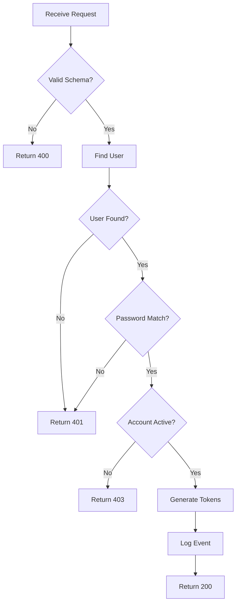

# Tutorial 4: Writing Specifications

> **Create Effective Component Specifications That Drive Quality Implementation**

---

## Overview

| | |
|---|---|
| **Difficulty** | Intermediate |
| **Time Required** | 25-30 minutes |
| **Prerequisites** | Completed Tutorials 1-3 |

### Learning Objectives

By the end of this tutorial, you will:

- Understand the anatomy of a Noderr specification
- Write clear, actionable specifications
- Define proper interfaces and dependencies
- Create effective ARC verification criteria
- Avoid common specification pitfalls

---

## Introduction

Specifications are the contract between intent and implementation. A good spec tells AI exactly what to build, how it should behave, and how to verify it's correct.

Poor specs lead to:
- Incomplete implementations
- Misunderstood requirements
- Endless iteration cycles
- Features that don't integrate properly

Great specs lead to:
- First-time-right implementations
- Clear verification criteria
- Maintainable code
- Accurate documentation

This tutorial teaches you to write great specs.

---

## Specification Template

Every Noderr specification follows this structure:

```markdown
# SPEC: [NodeID]

## Purpose
[1-2 sentences: What this component does and why it exists]

## Dependencies
- Upstream: [Components that call/use this one]
- Downstream: [Components this one calls/uses]

## Interface
[How other components interact with this one]

## Core Logic
[Step-by-step description of what happens internally]

## Data Structures
[Data formats, schemas, types used]

## Error Handling
[How errors are detected and communicated]

## ARC Verification Criteria
[Checklist to verify correct implementation]
```

Let's explore each section in depth.

---

## Section 1: Purpose

### What to Include

- **What** the component does (not how)
- **Why** it exists (the problem it solves)
- **Who** uses it (what triggers it)

### Good Examples

```markdown
## Purpose
Validates and processes user login attempts, returning authentication
tokens for valid credentials and appropriate error messages for invalid ones.
```

```markdown
## Purpose
Displays a sortable, filterable list of products with pagination,
allowing users to browse the catalog efficiently.
```

### Bad Examples

```markdown
## Purpose
Handles login.
```
*(Too vague - what does "handles" mean?)*

```markdown
## Purpose
This component uses React hooks to manage form state and calls the
API using fetch with proper headers and error handling...
```
*(Implementation details, not purpose)*

> **Tip**: If you can't explain the purpose in 1-2 sentences, the component might be doing too much.

---

## Section 2: Dependencies

### What to Include

- **Upstream**: Components that call this one
- **Downstream**: Components this one calls
- **External**: Third-party services or APIs

### Format

```markdown
## Dependencies

### Upstream (receives from)
- UI_LoginForm: Sends credentials for validation
- API_RefreshToken: Requests token refresh

### Downstream (sends to)
- SVC_UserService: Validates credentials
- SVC_TokenService: Generates JWT tokens
- DB_Sessions: Stores session records

### External
- None
```

### Dependency Diagram

For complex components, include a mini-diagram:

```markdown
## Dependencies

```
UI_LoginForm ──┐
               ├──▶ API_Login ──┬──▶ SVC_UserService
UI_MobileLogin─┘               ├──▶ SVC_TokenService
                               └──▶ DB_Sessions
```
```

> **Tip**: If a component has more than 5-6 dependencies, consider if it's doing too much.

---

## Section 3: Interface

### For API Endpoints

```markdown
## Interface

### Endpoint
POST /api/auth/login

### Request Headers
- Content-Type: application/json

### Request Body
```json
{
  "email": "string (required, valid email)",
  "password": "string (required, min 8 characters)",
  "rememberMe": "boolean (optional, default false)"
}
```

### Response - Success (200)
```json
{
  "success": true,
  "data": {
    "accessToken": "string (JWT, expires 15min)",
    "refreshToken": "string (only if rememberMe=true)",
    "user": {
      "id": "uuid",
      "email": "string",
      "name": "string"
    }
  }
}
```

### Response - Error (401)
```json
{
  "success": false,
  "error": {
    "code": "INVALID_CREDENTIALS",
    "message": "Email or password is incorrect"
  }
}
```
```

### For UI Components

```markdown
## Interface

### Props
| Prop | Type | Required | Default | Description |
|------|------|----------|---------|-------------|
| products | Product[] | Yes | - | Array of products to display |
| onSelect | (id: string) => void | Yes | - | Called when product selected |
| pageSize | number | No | 20 | Items per page |
| sortable | boolean | No | true | Enable column sorting |

### Events Emitted
- `product:selected` - When user clicks a product
- `page:changed` - When pagination changes
- `sort:changed` - When sort order changes

### Slots
- `header` - Custom header content
- `empty` - Content when no products
```

### For Services

```markdown
## Interface

### Methods

#### createUser(userData: CreateUserInput): Promise<User>
Creates a new user account.

**Parameters:**
- `userData.email`: string - Valid email address
- `userData.password`: string - Plain text password (will be hashed)
- `userData.name`: string - Display name

**Returns:** User object without password

**Throws:**
- `EmailExistsError` - If email already registered
- `ValidationError` - If input validation fails

#### findByEmail(email: string): Promise<User | null>
Finds a user by email address.

**Parameters:**
- `email`: string - Email to search for

**Returns:** User object or null if not found
```

> **Tip**: Be explicit about types. "string" is better than nothing, but "string (ISO8601 datetime)" is best.

---

## Section 4: Core Logic

### What to Include

- Step-by-step flow of execution
- Decision points and branching
- Key transformations
- Order of operations

### Format: Numbered Steps

```markdown
## Core Logic

1. Receive login request with email and password
2. Validate request body against schema
   - If invalid → return 400 with validation errors
3. Query database for user with matching email
   - If not found → return 401 (don't reveal email doesn't exist)
4. Compare provided password with stored hash using bcrypt
   - If mismatch → return 401
5. Check if user account is active
   - If inactive → return 403 with account status message
6. Generate access token (15 min expiry)
7. If rememberMe=true, generate refresh token (7 day expiry)
8. Log successful authentication event
9. Return success response with tokens and user data
```

### Format: Flowchart

For complex logic, include a diagram:

```markdown
## Core Logic


```

> **Tip**: Include enough detail that you could implement this without asking questions.

---

## Section 5: Data Structures

### What to Include

- Input/output data shapes
- Database schemas
- Internal state structures
- Type definitions

### Example

```markdown
## Data Structures

### User (Database)
```typescript
interface User {
  id: string;           // UUID v4
  email: string;        // Unique, lowercase
  passwordHash: string; // bcrypt hash
  name: string;         // Display name
  status: 'active' | 'inactive' | 'suspended';
  createdAt: Date;
  updatedAt: Date;
  lastLoginAt: Date | null;
}
```

### LoginRequest
```typescript
interface LoginRequest {
  email: string;
  password: string;
  rememberMe?: boolean;
}
```

### LoginResponse
```typescript
interface LoginResponse {
  success: true;
  data: {
    accessToken: string;
    refreshToken?: string;
    user: UserPublic;
  }
}

interface UserPublic {
  id: string;
  email: string;
  name: string;
}
```
```

> **Tip**: Use TypeScript interfaces even for non-TypeScript projects—they're clear and unambiguous.

---

## Section 6: Error Handling

### What to Include

- All possible error conditions
- How each is detected
- Response/behavior for each
- Error codes and messages

### Format: Table

```markdown
## Error Handling

| Condition | Detection | Response Code | Error Code | Message |
|-----------|-----------|---------------|------------|---------|
| Invalid JSON | JSON parse fails | 400 | PARSE_ERROR | Invalid request body |
| Missing email | Schema validation | 400 | VALIDATION_ERROR | Email is required |
| Invalid email format | Regex check | 400 | VALIDATION_ERROR | Invalid email format |
| Email not found | DB query returns null | 401 | INVALID_CREDENTIALS | Email or password incorrect |
| Wrong password | bcrypt compare fails | 401 | INVALID_CREDENTIALS | Email or password incorrect |
| Account suspended | status='suspended' | 403 | ACCOUNT_SUSPENDED | Account has been suspended |
| Database error | DB throws exception | 500 | INTERNAL_ERROR | An error occurred |
```

### Security Considerations

```markdown
### Security Notes
- Never reveal whether email exists in system
- Use same error message for "email not found" and "wrong password"
- Rate limit login attempts per IP and per email
- Log all failed attempts for security monitoring
```

> **Tip**: Security errors should be informative enough to debug but vague enough to prevent information leakage.

---

## Section 7: ARC Verification Criteria

### What to Include

- Specific, testable conditions
- Both functional and non-functional requirements
- Security and performance criteria
- Edge cases that must be handled

### Format: Checklist

```markdown
## ARC Verification Criteria

### Functional Requirements
- [ ] Login with valid credentials returns 200 with tokens
- [ ] Login with invalid email returns 401
- [ ] Login with invalid password returns 401
- [ ] Login with inactive account returns 403
- [ ] rememberMe=true returns refresh token
- [ ] rememberMe=false (or missing) omits refresh token

### Security Requirements
- [ ] Password never logged anywhere
- [ ] Same error for "wrong email" and "wrong password"
- [ ] Access token expires in 15 minutes
- [ ] Refresh token expires in 7 days
- [ ] Failed attempts logged with IP address

### Performance Requirements
- [ ] Response time < 200ms for 95th percentile
- [ ] bcrypt cost factor set to 12

### Testing Requirements
- [ ] Unit tests for all validation rules
- [ ] Unit tests for all error conditions
- [ ] Integration test for successful login flow
- [ ] Integration test for failed login flow
```

### Writing Good Criteria

**Good Criteria Are:**
- **Specific**: "Returns 401" not "handles errors"
- **Testable**: Can write a test that passes/fails
- **Independent**: Each item verifiable separately
- **Complete**: Cover all specified behavior

**Bad Criteria:**
```markdown
- [ ] Works correctly
- [ ] Handles errors properly
- [ ] Is secure
- [ ] Has good performance
```

> **Tip**: If you can't write a test for a criterion, it's too vague.

---

## Complete Specification Example

Here's a full specification putting it all together:

```markdown
# SPEC: API_CreateTask

## Purpose
Creates a new task in the user's task list, validating input and
returning the created task with server-generated fields.

## Dependencies

### Upstream
- UI_TaskForm: Sends new task data

### Downstream
- SVC_TaskService: Handles task creation logic
- DB_Tasks: Stores task records

## Interface

### Endpoint
POST /api/tasks

### Authentication
Required: Bearer token in Authorization header

### Request Body
```json
{
  "title": "string (required, 1-200 chars)",
  "description": "string (optional, max 2000 chars)",
  "dueDate": "string (optional, ISO8601 date)",
  "priority": "string (optional, enum: low|medium|high, default: medium)"
}
```

### Response - Success (201)
```json
{
  "success": true,
  "data": {
    "id": "uuid",
    "title": "string",
    "description": "string | null",
    "dueDate": "string | null",
    "priority": "low | medium | high",
    "status": "pending",
    "createdAt": "ISO8601",
    "updatedAt": "ISO8601"
  }
}
```

### Response - Error (400)
```json
{
  "success": false,
  "error": {
    "code": "VALIDATION_ERROR",
    "message": "Validation failed",
    "fields": {
      "title": "Title is required"
    }
  }
}
```

## Core Logic

1. Extract user ID from authenticated request
2. Validate request body:
   - title: required, 1-200 characters
   - description: optional, max 2000 characters
   - dueDate: optional, must be valid ISO8601, must be in future
   - priority: optional, must be one of [low, medium, high]
3. If validation fails → return 400 with field errors
4. Call SVC_TaskService.create() with:
   - userId from auth
   - validated task data
   - default status: "pending"
5. Return 201 with created task data

## Data Structures

### CreateTaskInput
```typescript
interface CreateTaskInput {
  title: string;
  description?: string;
  dueDate?: string;
  priority?: 'low' | 'medium' | 'high';
}
```

### Task
```typescript
interface Task {
  id: string;
  userId: string;
  title: string;
  description: string | null;
  dueDate: Date | null;
  priority: 'low' | 'medium' | 'high';
  status: 'pending' | 'in_progress' | 'completed';
  createdAt: Date;
  updatedAt: Date;
}
```

## Error Handling

| Condition | Code | Error Code | Details |
|-----------|------|------------|---------|
| No auth token | 401 | UNAUTHORIZED | - |
| Invalid token | 401 | UNAUTHORIZED | - |
| Missing title | 400 | VALIDATION_ERROR | fields.title |
| Title too long | 400 | VALIDATION_ERROR | fields.title |
| Description too long | 400 | VALIDATION_ERROR | fields.description |
| Invalid date format | 400 | VALIDATION_ERROR | fields.dueDate |
| Due date in past | 400 | VALIDATION_ERROR | fields.dueDate |
| Invalid priority | 400 | VALIDATION_ERROR | fields.priority |
| Database error | 500 | INTERNAL_ERROR | - |

## ARC Verification Criteria

### Functional
- [ ] Creates task with all required fields
- [ ] Creates task with all optional fields
- [ ] Creates task with only required fields (defaults apply)
- [ ] Rejects request without authentication
- [ ] Rejects request with missing title
- [ ] Rejects request with title > 200 chars
- [ ] Rejects request with description > 2000 chars
- [ ] Rejects request with invalid priority value
- [ ] Rejects request with past due date
- [ ] Returns created task with server-generated id, createdAt, updatedAt

### Security
- [ ] Validates authentication before processing
- [ ] Associates task with authenticated user only
- [ ] Sanitizes input to prevent XSS

### Testing
- [ ] Unit tests for input validation
- [ ] Unit tests for error responses
- [ ] Integration test for successful creation
- [ ] Integration test for validation errors
```

---

## Practical Exercise

### Your Task

Write a specification for `SVC_NotificationService` - a service that sends notifications to users.

### Requirements

The service should:
- Send email notifications
- Send push notifications (mobile)
- Support different notification types (alert, reminder, marketing)
- Allow users to have notification preferences
- Queue notifications for async processing

### Template to Complete

```markdown
# SPEC: SVC_NotificationService

## Purpose
[Your answer]

## Dependencies
[Your answer]

## Interface
[Your answer - define at least 2 methods]

## Core Logic
[Your answer - for the main send method]

## Data Structures
[Your answer]

## Error Handling
[Your answer]

## ARC Verification Criteria
[Your answer - at least 8 criteria]
```

### Solution

<details>
<summary>Click to reveal example solution</summary>

```markdown
# SPEC: SVC_NotificationService

## Purpose
Manages sending notifications to users across multiple channels
(email, push), respecting user preferences and handling delivery
asynchronously through a queue system.

## Dependencies

### Upstream
- API_SendNotification: Triggers notifications
- SVC_TaskService: Sends task reminders
- SVC_UserService: Sends account notifications

### Downstream
- SVC_EmailService: Sends email notifications
- SVC_PushService: Sends mobile push notifications
- DB_NotificationPreferences: User channel preferences
- DB_NotificationQueue: Pending notifications

### External
- AWS SQS: Message queue for async processing

## Interface

### Methods

#### send(notification: NotificationInput): Promise<NotificationResult>
Queues a notification for delivery based on user preferences.

**Parameters:**
- notification.userId: string - Target user ID
- notification.type: 'alert' | 'reminder' | 'marketing'
- notification.title: string - Notification title
- notification.body: string - Notification content
- notification.data?: object - Additional payload

**Returns:**
- notificationId: string - Tracking ID
- channels: string[] - Channels notification will be sent to

**Throws:**
- UserNotFoundError - If userId doesn't exist
- InvalidNotificationTypeError - If type not recognized

#### getUserPreferences(userId: string): Promise<NotificationPreferences>
Gets user's notification preferences.

#### updatePreferences(userId: string, prefs: PreferencesUpdate): Promise<void>
Updates user's notification preferences.

## Core Logic

### send() Method
1. Validate notification input
2. Fetch user from database
   - If not found → throw UserNotFoundError
3. Fetch user's notification preferences
4. Determine target channels based on:
   - User preferences for this notification type
   - Channel availability (has email? has push token?)
5. For each enabled channel:
   - Create queue message with channel-specific payload
   - Push to notification queue
6. Store notification record in database
7. Return notification ID and target channels

### Queue Processor (separate worker)
1. Pull message from queue
2. Route to appropriate service (email/push)
3. Attempt delivery
4. On success: mark delivered
5. On failure: retry with backoff (max 3 attempts)
6. After max retries: mark failed, log for review

## Data Structures

### NotificationInput
```typescript
interface NotificationInput {
  userId: string;
  type: 'alert' | 'reminder' | 'marketing';
  title: string;
  body: string;
  data?: Record<string, unknown>;
}
```

### NotificationPreferences
```typescript
interface NotificationPreferences {
  userId: string;
  email: {
    enabled: boolean;
    alerts: boolean;
    reminders: boolean;
    marketing: boolean;
  };
  push: {
    enabled: boolean;
    alerts: boolean;
    reminders: boolean;
    marketing: boolean;
  };
}
```

### NotificationRecord
```typescript
interface NotificationRecord {
  id: string;
  userId: string;
  type: string;
  title: string;
  body: string;
  channels: string[];
  status: 'queued' | 'sent' | 'failed';
  createdAt: Date;
  sentAt: Date | null;
}
```

## Error Handling

| Condition | Exception | Recovery |
|-----------|-----------|----------|
| User not found | UserNotFoundError | None - caller error |
| Invalid type | InvalidNotificationTypeError | None - caller error |
| Queue unavailable | QueueConnectionError | Retry 3x, then fail |
| Email service down | Retry via queue | Backoff retry |
| Push service down | Retry via queue | Backoff retry |

## ARC Verification Criteria

### Functional
- [ ] Sends notification to email when user has email enabled
- [ ] Sends notification to push when user has push enabled
- [ ] Respects per-type preferences (alerts, reminders, marketing)
- [ ] Does not send to disabled channels
- [ ] Returns correct list of target channels
- [ ] Stores notification record for audit

### Reliability
- [ ] Handles queue unavailability gracefully
- [ ] Retries failed deliveries up to 3 times
- [ ] Uses exponential backoff for retries
- [ ] Marks notification as failed after max retries

### Security
- [ ] Validates userId exists before processing
- [ ] Does not leak user data in error messages
- [ ] Sanitizes notification content

### Testing
- [ ] Unit tests for preference filtering logic
- [ ] Unit tests for channel routing
- [ ] Integration test for end-to-end delivery
- [ ] Test for retry behavior on failure
```

</details>

---

## Common Issues & Solutions

| Issue | Cause | Solution |
|-------|-------|----------|
| Specs too vague | Fear of over-specifying | Be specific—AI can adapt |
| Specs too detailed | Including implementation | Focus on what, not how |
| Missing edge cases | Not thinking through flow | Walk through error scenarios |
| ARC criteria untestable | Vague language | Rewrite as assertions |
| Deps incomplete | Forgot downstream calls | Trace full execution path |

---

## Key Takeaways

- **Purpose** should be 1-2 sentences explaining what and why
- **Dependencies** create the integration map
- **Interfaces** are contracts—be explicit about types and formats
- **Core Logic** describes flow without implementation details
- **Error Handling** covers every failure mode
- **ARC Criteria** are testable, specific conditions

---

## Next Steps

With strong specification skills, explore advanced Noderr capabilities:

**[Tutorial 5: Advanced Prompts](05-advanced-prompts.md)** - Use specialized workflows for audits, refactoring, and complex operations.

---

## Quick Reference

### Specification Checklist

- [ ] Purpose: Clear, concise, explains what and why
- [ ] Dependencies: All upstream and downstream listed
- [ ] Interface: Complete contracts with types
- [ ] Core Logic: Step-by-step flow
- [ ] Data Structures: All types defined
- [ ] Error Handling: All failures covered
- [ ] ARC Criteria: Specific, testable items

### Common Interface Patterns

| Component Type | Key Interface Elements |
|---------------|------------------------|
| API Endpoint | Method, path, request, response |
| UI Component | Props, events, slots |
| Service | Methods with params, returns, throws |
| Database | Schema, indexes, constraints |
