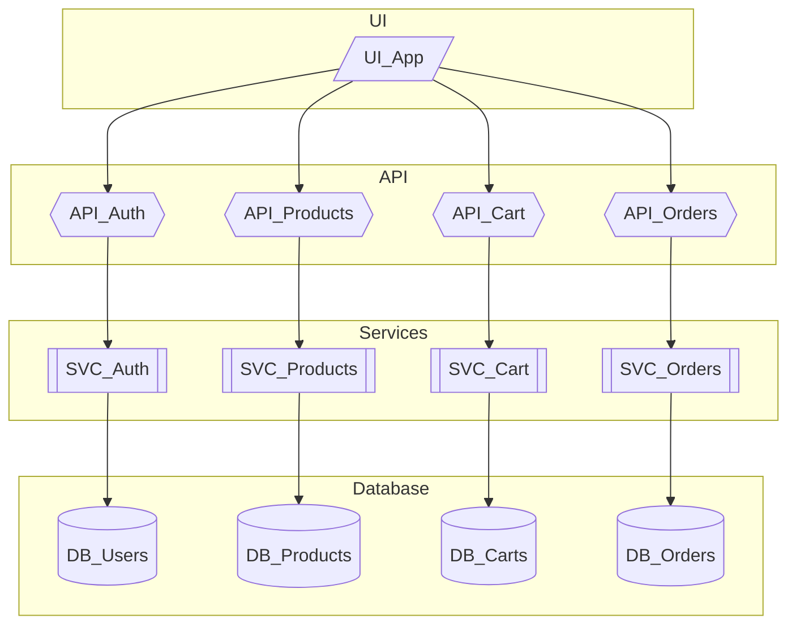
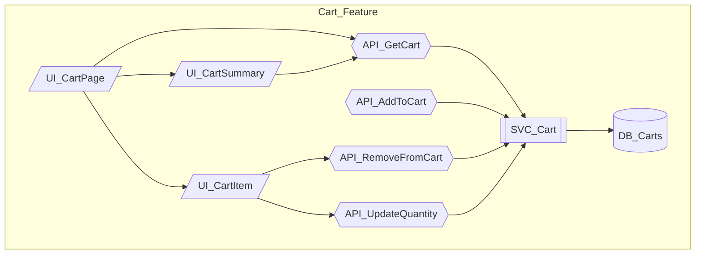
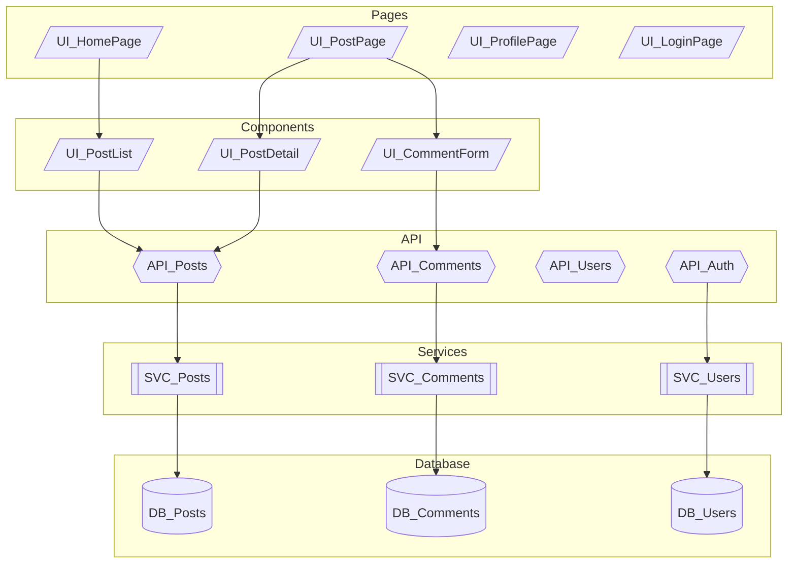

# Tutorial 6: Retrofitting Existing Projects

> **Add Noderr Methodology to Legacy Codebases**

---

## Overview

| | |
|---|---|
| **Difficulty** | Advanced |
| **Time Required** | 40-50 minutes |
| **Prerequisites** | Completed Tutorials 1-5 |

### Learning Objectives

By the end of this tutorial, you will:

- Assess existing projects for Noderr compatibility
- Develop a retrofitting strategy
- Extract architecture from existing code
- Create specifications for existing components
- Integrate Noderr workflows without disrupting development

---

## Introduction

Starting fresh with Noderr is easy—but most developers have existing projects. This tutorial shows you how to add Noderr's structure, memory, and quality gates to a codebase that wasn't built with it.

**The Challenge:**
- Code exists but has no NodeIDs
- Architecture is implicit, not documented
- Specifications don't exist
- You can't stop development to "Noderr-ify" everything

**The Solution:**
A phased approach that:
- Adds Noderr infrastructure immediately
- Documents incrementally as you work
- Doesn't require documenting everything at once
- Maintains development velocity

---

## Phase 1: Assessment

### Step 1: Evaluate Project State

Before retrofitting, understand what you're working with.

**Key Questions:**

```
PROJECT ASSESSMENT CHECKLIST

□ Project Size
  - Approximately how many files?
  - How many distinct "modules" or "features"?
  - Estimated lines of code?

□ Architecture Clarity
  - Is there any architecture documentation?
  - Are component boundaries clear?
  - Is there consistent file organization?

□ Code Quality
  - Are there tests?
  - Is there a consistent coding style?
  - Are dependencies explicit or implicit?

□ Team Situation
  - Solo or team project?
  - Active development or maintenance mode?
  - How familiar is the team with the codebase?

□ Technical Debt
  - Known problematic areas?
  - Features that are hard to modify?
  - Parts that "nobody wants to touch"?
```

### Step 2: Identify Component Boundaries

Look for natural boundaries in the code:

**Frontend Projects:**
- Pages/routes
- Reusable components
- State management modules
- API client functions
- Utility libraries

**Backend Projects:**
- API endpoints/controllers
- Service classes
- Database models/repositories
- Middleware functions
- Background job processors

**Full-Stack:**
- All of the above, plus:
- Shared types/interfaces
- Integration points

### Example Assessment

```
## Project: E-Commerce Platform (Legacy)

### Size
- ~150 files
- ~15,000 LOC
- 5 main feature areas: Products, Orders, Users, Cart, Admin

### Architecture
- No documentation
- Reasonable file structure (routes/, services/, models/)
- Some circular dependencies

### Quality
- ~30% test coverage
- ESLint configured but many warnings ignored
- Inconsistent error handling

### Team
- 2 developers
- Active development (1-2 features/month)
- Original developer no longer on team

### Technical Debt
- User service is "scary to modify"
- Cart logic scattered across components
- No API documentation

### Assessment: GOOD candidate for retrofitting
- Clear file structure makes NodeID assignment possible
- Active development means immediate benefit
- Technical debt areas will benefit from specifications
```

---

## Phase 2: Install Noderr Framework

### Step 1: Add Noderr Files

Use the standard installation process:

```bash
# From your project root
unzip noderr.starter.zip
```

This creates the `/noderr` directory with all framework files.

### Step 2: Initial Configuration

Use the retrofit prompt instead of standard installation:

**Prompt:** `NDv1.9__Retrofit_Existing_Project.md`

**What It Does:**
- Analyzes your existing codebase
- Proposes initial NodeID assignments
- Creates skeleton architecture diagram
- Sets up tracker with discovered components

**Example Interaction:**

```
AI: I've analyzed your codebase. Here's what I found:

## Discovered Components

### API Layer (12 endpoints)
- POST /api/auth/login → API_Login
- POST /api/auth/register → API_Register
- GET /api/products → API_GetProducts
- GET /api/products/:id → API_GetProduct
- POST /api/cart/add → API_AddToCart
- DELETE /api/cart/:id → API_RemoveFromCart
- GET /api/cart → API_GetCart
- POST /api/orders → API_CreateOrder
- GET /api/orders → API_GetOrders
- GET /api/orders/:id → API_GetOrder
- GET /api/users/me → API_GetCurrentUser
- PUT /api/users/me → API_UpdateUser

### Services (6 identified)
- AuthService → SVC_Auth
- ProductService → SVC_Products
- CartService → SVC_Cart
- OrderService → SVC_Orders
- UserService → SVC_Users
- EmailService → SVC_Email

### Database Models (5 identified)
- User → DB_Users
- Product → DB_Products
- Cart → DB_Carts
- Order → DB_Orders
- OrderItem → DB_OrderItems

### UI Components (will need manual analysis)
[React components detected but require review]

### Proposed Initial Architecture
[Mermaid diagram...]

Shall I create the initial Noderr files with these assignments?
```

### Step 3: Review and Adjust

The AI's proposals need your validation:

- **Verify NodeID names** make sense
- **Check nothing major was missed**
- **Adjust boundaries** if components are misidentified
- **Add missing items** you know about

---

## Phase 3: Create Architecture Diagram

### Strategy: Start Broad, Refine Later

Don't try to create a perfect diagram immediately. Start with major components:



### Expand as You Work

When you touch a component, add detail:



---

## Phase 4: Incremental Specification Creation

### The "Specify-When-Touched" Rule

**Don't try to document everything at once.** Instead:

1. **When you modify a component** → Create/update its spec
2. **When you debug a component** → Document what you learned
3. **When a component causes issues** → Specify it properly

### Specification Priority Matrix

| Priority | When to Specify |
|----------|-----------------|
| **Immediate** | Components you're actively changing |
| **High** | "Scary" code nobody wants to touch |
| **Medium** | Frequently modified components |
| **Low** | Stable components that rarely change |
| **Skip** | Simple utilities, obvious components |

### Minimal Viable Spec

For initial retrofitting, create minimal specs:

```markdown
# SPEC: API_CreateOrder

## Purpose
Creates a new order from the user's cart.

## Status: NEEDS_FULL_SPEC
This is an initial retrofit spec. Full specification pending.

## Dependencies
- Upstream: UI_Checkout
- Downstream: SVC_Orders, SVC_Cart, SVC_Email

## Interface (Known)
- POST /api/orders
- Requires authentication
- Returns order object

## Notes
- Current implementation has no validation
- Error handling needs improvement
- No tests exist

## TODO
- [ ] Document request/response format
- [ ] Document error handling
- [ ] Add ARC criteria
```

### Full Spec When Working on Component

When you actually work on a component, upgrade to full spec:

```markdown
# SPEC: API_CreateOrder

## Purpose
Creates a new order from the authenticated user's cart, validating
inventory, processing payment, and sending confirmation email.

## Dependencies
[Full dependency list...]

## Interface
[Complete interface specification...]

## Core Logic
[Detailed flow...]

## Error Handling
[Complete error table...]

## ARC Verification Criteria
[Full checklist...]
```

---

## Phase 5: Set Up Tracker

### Initial Tracker State

For retrofitted projects, use status `LEGACY`:

```markdown
# Project Tracker

## Status Legend
- LEGACY: Existing code, not yet under Noderr management
- NEEDS_SPEC: Code exists, specification needed
- TODO: New work not started
- WIP: Work in progress
- VERIFIED: Implemented and verified
- ISSUE: Has known problems

## Status Map

| NodeID | Status | Notes |
|--------|--------|-------|
| API_Login | LEGACY | Works, no spec |
| API_Register | LEGACY | Works, no spec |
| API_GetProducts | LEGACY | Works, has bugs |
| API_GetProduct | LEGACY | Works, no spec |
| API_CreateOrder | NEEDS_SPEC | Modified recently |
| SVC_Auth | LEGACY | "Scary code" - prioritize |
| SVC_Cart | WIP | Currently being refactored |
| DB_Users | LEGACY | Schema documented |
```

### Transition Rules

```
LEGACY → NEEDS_SPEC: When you decide to work on it
NEEDS_SPEC → WIP: When you start specification
WIP → VERIFIED: When spec + implementation verified
```

---

## Phase 6: Establish Workflows

### For New Features

Use standard Noderr loop:
1. LOOP_1A: Propose Change Set
2. LOOP_1B: Draft specs (including any LEGACY nodes being modified)
3. LOOP_2A: Implement
4. LOOP_2B: Verify
5. LOOP_3: Finalize

### For Bug Fixes in Legacy Code

**Small fix (single component):**
1. Use `Execute_Micro_Fix`
2. Create minimal spec if none exists
3. Mark as NEEDS_SPEC for future

**Large fix (multiple components):**
1. Create NEEDS_SPEC entries for affected components
2. Use standard loop
3. Upgrade specs as you fix

### For Refactoring Legacy Code

1. Create specs for current state ("as-is")
2. Use `Refactor_Node` to plan changes
3. Execute via standard loop
4. Update specs to "as-built"

---

## Phase 7: Gradual Migration

### Week 1-2: Foundation

- [ ] Install Noderr files
- [ ] Run retrofit analysis
- [ ] Create initial architecture diagram
- [ ] Set up tracker with LEGACY status
- [ ] Document environment context

### Week 3-4: Active Areas

- [ ] Identify most-modified components
- [ ] Create specs for active work areas
- [ ] Start using loop for new features
- [ ] Mark specs as team creates them

### Month 2: Expansion

- [ ] Specify "scary" code areas
- [ ] Run first architecture health review
- [ ] Address findings from audit
- [ ] Team comfortable with workflow

### Month 3+: Steady State

- [ ] All new work uses Noderr loop
- [ ] Specs created when touching code
- [ ] Regular audits catch drift
- [ ] LEGACY items gradually converted

---

## Practical Exercise

### Your Task

Retrofit Noderr onto a sample project structure.

### Sample Project Structure

```
blog-platform/
├── src/
│   ├── api/
│   │   ├── posts.js
│   │   ├── comments.js
│   │   ├── users.js
│   │   └── auth.js
│   ├── services/
│   │   ├── PostService.js
│   │   ├── CommentService.js
│   │   ├── UserService.js
│   │   └── EmailService.js
│   ├── models/
│   │   ├── Post.js
│   │   ├── Comment.js
│   │   └── User.js
│   ├── components/
│   │   ├── PostList.jsx
│   │   ├── PostDetail.jsx
│   │   ├── CommentForm.jsx
│   │   ├── UserProfile.jsx
│   │   └── Header.jsx
│   └── pages/
│       ├── Home.jsx
│       ├── Post.jsx
│       ├── Profile.jsx
│       └── Login.jsx
├── tests/
│   └── (sparse tests)
├── package.json
└── README.md
```

### Instructions

1. **Identify NodeIDs** for each component type
2. **Create initial architecture diagram**
3. **Set up tracker** with appropriate statuses
4. **Identify priority specs** (which would you specify first?)
5. **Plan the retrofit timeline**

### Solution

<details>
<summary>Click to reveal solution</summary>

**NodeID Assignments:**

```
API Layer:
- api/posts.js → API_GetPosts, API_GetPost, API_CreatePost, API_UpdatePost, API_DeletePost
- api/comments.js → API_GetComments, API_CreateComment, API_DeleteComment
- api/users.js → API_GetUser, API_UpdateUser
- api/auth.js → API_Login, API_Register, API_Logout

Services:
- PostService.js → SVC_Posts
- CommentService.js → SVC_Comments
- UserService.js → SVC_Users
- EmailService.js → SVC_Email

Database:
- Post.js → DB_Posts
- Comment.js → DB_Comments
- User.js → DB_Users

UI Pages:
- Home.jsx → UI_HomePage
- Post.jsx → UI_PostPage
- Profile.jsx → UI_ProfilePage
- Login.jsx → UI_LoginPage

UI Components:
- PostList.jsx → UI_PostList
- PostDetail.jsx → UI_PostDetail
- CommentForm.jsx → UI_CommentForm
- UserProfile.jsx → UI_UserProfile
- Header.jsx → UI_Header
```

**Initial Architecture:**



**Priority Specs:**
1. API_Auth (security-critical)
2. SVC_Users (if it's "scary")
3. Whatever you're working on next

**Timeline:**
- Week 1: Install, analyze, initial architecture
- Week 2: Spec auth and user components
- Week 3-4: Spec as you work on features
- Month 2+: Continue migration

</details>

---

## Common Issues & Solutions

| Issue | Cause | Solution |
|-------|-------|----------|
| Overwhelming number of files | Large codebase | Start with major features only |
| Unclear component boundaries | Tangled code | Use logical boundaries, refine later |
| Team resistance | "Extra work" perception | Show value on first feature |
| Specs become outdated | Not maintained | Enforce update in code review |
| Architecture diagram too complex | Too detailed | Use subgraphs, multiple diagrams |

---

## Key Takeaways

- **Retrofit incrementally** - Don't try to document everything
- **Specify when touched** - Create specs as you work
- **Start with architecture** - Visual map enables everything else
- **Use LEGACY status** - Distinguishes old from new work
- **Value compounds** - Each spec makes future work easier

---

## Next Steps

Learn best practices and troubleshooting tips:

**[Tutorial 7: Best Practices & Troubleshooting](07-best-practices.md)** - Tips, tricks, and solutions for common situations.

---

## Quick Reference

### Retrofit Phases

1. **Assess** - Understand current state
2. **Install** - Add Noderr files
3. **Diagram** - Create initial architecture
4. **Specify** - Incrementally as you work
5. **Track** - Use LEGACY/NEEDS_SPEC statuses
6. **Workflow** - Adopt loop for new work
7. **Migrate** - Gradually convert legacy items

### Status Progression

```
LEGACY → NEEDS_SPEC → WIP → VERIFIED
   ↓
(stays LEGACY until you decide to work on it)
```

### Priority Order

1. Security-critical components
2. "Scary" or problematic code
3. Frequently modified areas
4. Active feature development
5. Stable, rarely-touched code
