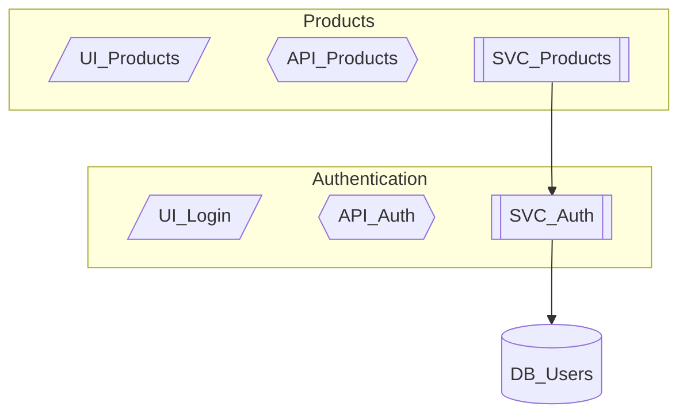

# Tutorial 7: Best Practices & Troubleshooting

> **Tips, Tricks, and Solutions for Mastering Noderr**

---

## Overview

| | |
|---|---|
| **Difficulty** | Reference |
| **Time Required** | 15-20 minutes |
| **Prerequisites** | Familiarity with Noderr concepts |

### What This Tutorial Covers

- Best practices for effective Noderr usage
- Common mistakes and how to avoid them
- Troubleshooting guide for frequent issues
- Tips for teams and collaboration
- FAQ with detailed answers

---

## Part 1: Best Practices

### 1.1 Session Management

**Start Every Session Fresh**

```
DO:
- Use "Start_Work_Session" prompt at session start
- Let AI read all Noderr files before working
- Verify tracker state matches reality

DON'T:
- Jump straight into coding
- Assume AI remembers previous sessions
- Skip the initialization step
```

**End Sessions Cleanly**

```
DO:
- Complete current loop phase before stopping
- Commit all changes
- Update tracker with current state
- Note any pending work in log

DON'T:
- Stop mid-implementation
- Leave uncommitted changes
- Forget to update tracker
```

**Handle Interruptions**

If you must stop mid-work:
1. Note current phase in tracker
2. Commit partial work (WIP commit)
3. Add log entry explaining state
4. Use "Resume_Active_Loop" when returning

---

### 1.2 Change Set Management

**Keep Change Sets Focused**

```
GOOD: Change Set for "Add user login"
- UI_LoginForm
- API_Login
- SVC_Auth (modify)
- DB_Sessions (create)
Total: 4 NodeIDs - focused, manageable

BAD: Change Set for "Improve authentication"
- UI_LoginForm
- UI_RegisterForm
- UI_ForgotPassword
- UI_ResetPassword
- API_Login
- API_Register
- API_ForgotPassword
- API_ResetPassword
- SVC_Auth
- SVC_Email
- DB_Users
- DB_Sessions
- DB_PasswordResets
Total: 13 NodeIDs - too large, split into multiple features
```

**Rule of Thumb:**
- 1-5 NodeIDs: Good, proceed normally
- 6-10 NodeIDs: Consider if splittable
- 10+ NodeIDs: Almost always split into phases

**Handling Large Features**

Break into phases:
```
Phase 1: Core login (4 NodeIDs)
Phase 2: Registration (4 NodeIDs)
Phase 3: Password reset (5 NodeIDs)
```

Complete each phase through the full loop before starting next.

---

### 1.3 Specification Quality

**Write Specs for Your Future Self**

Your specification should answer:
- What does this do? (Purpose)
- What does it need? (Dependencies)
- How do I call it? (Interface)
- What should happen? (Logic)
- What could go wrong? (Errors)
- How do I know it works? (ARC)

**Interface Clarity**

```
VAGUE:
"Takes user data and returns result"

CLEAR:
Request: POST /api/users
Body: { email: string, name: string, password: string }
Response 201: { id: string, email: string, name: string }
Response 400: { error: "VALIDATION_ERROR", fields: {...} }
Response 409: { error: "EMAIL_EXISTS" }
```

**ARC Criteria That Work**

```
UNTESTABLE:
- [ ] Works correctly
- [ ] Handles errors properly
- [ ] Is fast enough

TESTABLE:
- [ ] Returns 201 with user ID on valid input
- [ ] Returns 400 when email is missing
- [ ] Returns 409 when email already exists
- [ ] Response time < 200ms for 95th percentile
```

---

### 1.4 Architecture Diagram Maintenance

**Keep It Current**

Update architecture diagram:
- After adding new NodeIDs
- After removing NodeIDs
- After changing relationships
- During LOOP_3 (always)

**Keep It Readable**

```
TOO DETAILED (hard to read):
- Every UI component with all props
- Every service method as separate node
- All error flows shown

RIGHT LEVEL:
- Major components as nodes
- Key relationships shown
- Subgraphs for logical grouping
```

**Use Subgraphs for Organization**



---

### 1.5 Verification Discipline

**Never Skip Verification**

Even if implementation "looks done":
- Run LOOP_2B verification
- Check completion percentage
- Address gaps before finalizing

**Verification Thresholds**

| Completion | Action |
|------------|--------|
| 95-100% | Accept, finalize |
| 85-94% | Review gaps, decide |
| 70-84% | Iterate, fix gaps |
| <70% | Major issues, investigate |

**Honest Assessment**

Tell AI to be strict in verification:
- "Be thorough in checking each ARC criterion"
- "Report any gaps, even minor ones"
- "Don't assume things work without checking"

---

### 1.6 Git Practices

**WorkGroupID in Commits**

```
GOOD:
[feat-20250109-143022] Add user authentication

- UI_LoginForm: Created login component
- API_Login: Implemented login endpoint
- SVC_Auth: Added authentication service

BAD:
Fixed some stuff

updated files
```

**Commit Timing**

```
Commit Points:
- After LOOP_1B (specs approved) - optional "spec commit"
- After LOOP_2A (implementation done) - required
- After LOOP_3 (finalization) - required

Don't Commit:
- Mid-implementation
- Before verification
- With failing tests
```

**Branch Strategy**

```
main/master
  └── feature/[workgroupid]-description
        └── Develop here
        └── PR back to main when verified
```

---

## Part 2: Common Mistakes & How to Avoid Them

### Mistake 1: Skipping Specification Approval

**The Problem:**
Jumping from LOOP_1A straight to LOOP_2A.

**Why It's Bad:**
- Specs might not match intent
- Discover issues mid-implementation
- Rework required

**The Fix:**
Always pause after LOOP_1B for spec review. Even a quick review catches issues.

---

### Mistake 2: Incomplete Change Sets

**The Problem:**
Starting implementation before identifying all affected NodeIDs.

**Why It's Bad:**
- Broken integrations
- Missing functionality
- "It works in isolation" bugs

**The Fix:**
In LOOP_1A, explicitly ask:
- "What else might this affect?"
- "Are there any downstream dependencies?"
- "What would break if we only did these nodes?"

---

### Mistake 3: Spec Drift

**The Problem:**
Specifications don't match implementation.

**Why It's Bad:**
- AI works from wrong information
- Future developers confused
- Bugs from wrong assumptions

**The Fix:**
- Update specs during LOOP_3 (as-built)
- Run periodic Holistic Integration Audits
- Make spec updates part of code review

---

### Mistake 4: Monolithic Change Sets

**The Problem:**
Trying to implement huge features in one Change Set.

**Why It's Bad:**
- Hard to verify
- Easy to miss things
- Difficult to debug

**The Fix:**
- Split features into phases
- Each phase is its own Change Set
- Each phase goes through complete loop

---

### Mistake 5: Ignoring Verification Results

**The Problem:**
Accepting "85% complete" and moving on.

**Why It's Bad:**
- Technical debt accumulates
- Missing 15% causes bugs later
- Quality standards erode

**The Fix:**
- Take verification seriously
- Fix gaps before accepting
- Only accept <95% with documented reason

---

## Part 3: Troubleshooting Guide

### Issue: AI Doesn't Follow Noderr Process

**Symptoms:**
- AI starts coding without reading files
- AI skips specification phase
- AI doesn't update tracker

**Solutions:**
1. Start fresh conversation
2. Use correct prompt file
3. Explicitly instruct: "Read all Noderr files first"
4. Verify AI acknowledged reading files before proceeding

---

### Issue: Architecture Diagram Errors

**Symptoms:**
- Mermaid syntax errors
- Diagram doesn't render
- Missing components

**Solutions:**
1. Use Mermaid live editor to validate
2. Check for typos in NodeIDs
3. Ensure arrows use correct syntax (`-->` not `->`)
4. Verify all referenced nodes are defined

**Common Mermaid Syntax Issues:**
```
WRONG: UI_Login -> API_Auth
RIGHT: UI_Login --> API_Auth

WRONG: [UI_Login]
RIGHT: UI_Login[/UI_Login/]

WRONG: flowchart
RIGHT: flowchart TD
```

---

### Issue: Tracker Out of Sync

**Symptoms:**
- Tracker shows WIP but code is complete
- Tracker missing NodeIDs
- Status doesn't match reality

**Solutions:**
1. Manually update tracker
2. Run Holistic Integration Audit
3. Have AI reconcile tracker with codebase
4. Ensure LOOP_3 completes fully

---

### Issue: Specifications Are Vague

**Symptoms:**
- Implementation doesn't match expectations
- AI asks many clarifying questions
- Verification fails on basics

**Solutions:**
1. Review Tutorial 4 on writing specs
2. Add explicit interface definitions
3. Include example requests/responses
4. Make ARC criteria specific and testable

---

### Issue: AI Loses Context Mid-Session

**Symptoms:**
- AI forgets what was discussed
- AI re-reads files unnecessarily
- AI contradicts earlier statements

**Solutions:**
1. Keep conversations focused on one Change Set
2. Start new conversation for new features
3. Use "Resume_Active_Loop" if continuing
4. Consider AI context limits for very long sessions

---

### Issue: Team Members Conflicting on Files

**Symptoms:**
- Git merge conflicts in Noderr files
- Tracker shows contradictory states
- Architecture diagrams diverged

**Solutions:**
1. One person owns tracker updates per feature
2. Merge Noderr files carefully (not auto-merge)
3. Communicate about which NodeIDs each person is working on
4. Use feature branches per Change Set

---

## Part 4: Team Usage Tips

### Establishing Team Conventions

**NodeID Naming:**
```
Agree on:
- Prefix conventions (UI_, API_, SVC_, DB_)
- Naming style (PascalCase, descriptive)
- Granularity (when to split vs. combine)

Document in noderr_project.md
```

**Specification Standards:**
```
Agree on:
- Required sections (minimum: Purpose, Interface, ARC)
- Interface format (TypeScript interfaces? JSON examples?)
- ARC criteria count (minimum 5? 10?)

Create a spec template
```

**Review Process:**
```
Code Review Checklist:
□ Spec exists and is current
□ Architecture diagram updated
□ Tracker status correct
□ ARC criteria passing
□ WorkGroupID in commit
```

---

### Onboarding New Team Members

**Week 1:**
1. Complete Tutorials 1-3
2. Shadow experienced team member
3. Work on small, isolated task with guidance

**Week 2:**
1. Complete Tutorials 4-5
2. Independent small feature
3. Review process explained

**Week 3+:**
1. Complete Tutorial 6-7
2. Full independence
3. Can onboard others

**Use This Prompt:**
`NDv1.9__Onboarding_Audit_Verification.md` - Validates new member understands the codebase.

---

### Handling Concurrent Development

**Strategy: Feature Branches + Communication**

```
Developer A: feat-20250109-user-auth
Developer B: feat-20250109-product-search

Rules:
1. Don't modify same NodeIDs without coordinating
2. Merge to main frequently
3. Update shared files (architecture) carefully
4. Communicate about interface changes
```

**Shared NodeID Protocol:**

If multiple people need to modify same NodeID:
1. First person creates spec changes
2. Share spec with others for input
3. Coordinate implementation timing
4. One person does final merge

---

## Part 5: Frequently Asked Questions

### General Questions

**Q: Do I need to specify EVERY component?**

A: No. Specify components you're actively working on. Use "Specify-When-Touched" approach for existing code. Trivial utilities can remain unspecified.

---

**Q: How long should specifications be?**

A: Long enough to be useful, short enough to maintain. A typical spec is 50-150 lines. Complex components might be 200+. Simple ones might be 30.

---

**Q: Can I use Noderr for non-code projects?**

A: The methodology is designed for software, but concepts (nodes, specifications, verification) could adapt to other domains. Results may vary.

---

**Q: What if AI suggests something wrong?**

A: You're the authority. Reject incorrect suggestions, provide clarification, and have AI revise. AI is a tool, not the decision-maker.

---

### Technical Questions

**Q: What's the difference between LOOP_2A and LOOP_2B?**

A: LOOP_2A is implementation (building the code). LOOP_2B is verification (checking against specs). They serve different purposes—implementation is active, verification is auditing.

---

**Q: When should I use Micro Fix vs. main loop?**

A: Micro Fix for single-component, isolated fixes. Main loop for anything touching multiple components or adding features. When in doubt, use main loop.

---

**Q: How do I handle dependencies between Change Sets?**

A: Complete Phase 1 fully before starting Phase 2. Don't start implementing Phase 2 until Phase 1 is verified and committed.

---

**Q: What if verification keeps failing?**

A:
1. Check if specs are realistic
2. Check if implementation actually meets specs
3. Consider if specs need modification
4. Break down into smaller pieces if too complex

---

### Process Questions

**Q: How strict should ARC verification be?**

A: Strict enough to catch real issues, pragmatic enough to ship. 95% is a good threshold. Below 90% usually indicates real problems.

---

**Q: What if I disagree with AI's Change Set proposal?**

A: Modify it. Add NodeIDs you know are affected. Remove ones that aren't. You know your codebase better than AI does.

---

**Q: Should I create specs before or during implementation?**

A: Before, during LOOP_1B. Specs guide implementation. Creating specs after defeats the purpose.

---

**Q: How often should I run audits?**

A:
- Security: Monthly or after auth changes
- Architecture: Every 2-4 weeks or when "feels messy"
- Integration: After major features, before releases

---

## Quick Reference Cards

### Session Checklist

```
Starting Session:
□ Fresh conversation with AI
□ Use Start_Work_Session prompt
□ AI confirms reading all Noderr files
□ Review tracker for current state
□ Identify what to work on

Ending Session:
□ Complete current loop phase
□ All changes committed
□ Tracker updated
□ Log entry if needed
□ Note any pending work
```

### Change Set Checklist

```
Proposing (LOOP_1A):
□ All affected NodeIDs identified
□ Dependencies mapped
□ No missing components
□ Scope is manageable (≤10 NodeIDs ideal)

Drafting (LOOP_1B):
□ Spec created for each NodeID
□ Interfaces fully defined
□ ARC criteria specific and testable
□ User approved before proceeding
```

### Verification Checklist

```
Before Accepting:
□ Completion ≥ 95%
□ All ARC criteria checked
□ Tests passing
□ No critical gaps
□ Ready for production
```

### Commit Checklist

```
Before Committing:
□ Implementation complete
□ Verification passed
□ Specs updated (as-built)
□ Architecture updated
□ Tracker updated
□ Log entry created
□ WorkGroupID in message
```

---

## Conclusion

Mastering Noderr is a journey, not a destination. The key principles to remember:

1. **Structure enables quality** - The process exists for good reasons
2. **Specifications are contracts** - Clear specs lead to clear implementation
3. **Verification is non-negotiable** - Always check your work
4. **Documentation stays current** - As-built, not as-intended
5. **Iterate and improve** - Your process should evolve too

With these best practices and troubleshooting knowledge, you're equipped to use Noderr effectively on any project.

---

## Resources

### Quick Links

- [Repository Summary](../NODERR_REPOSITORY_SUMMARY.md)
- [Getting Started Guide](../noderr_getting_started.md)
- [Understanding Noderr](../understanding-noderr.md)
- [Prompts Reference](../noderr_prompts_guide.md)

### Tutorial Series

1. [Quick Start](01-quick-start.md)
2. [Understanding Core Files](02-core-files.md)
3. [The Development Loop](03-development-loop.md)
4. [Writing Specifications](04-writing-specifications.md)
5. [Advanced Prompts](05-advanced-prompts.md)
6. [Retrofitting Projects](06-retrofitting-projects.md)
7. Best Practices (this document)

---

*Congratulations on completing the Noderr tutorial series!*

*You now have the knowledge to transform AI-assisted development from chaotic coding into disciplined software engineering.*
